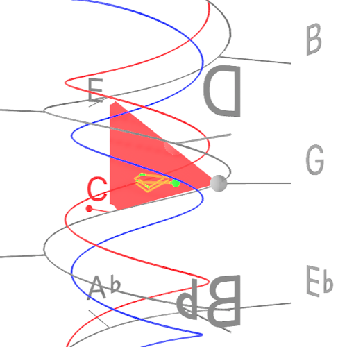
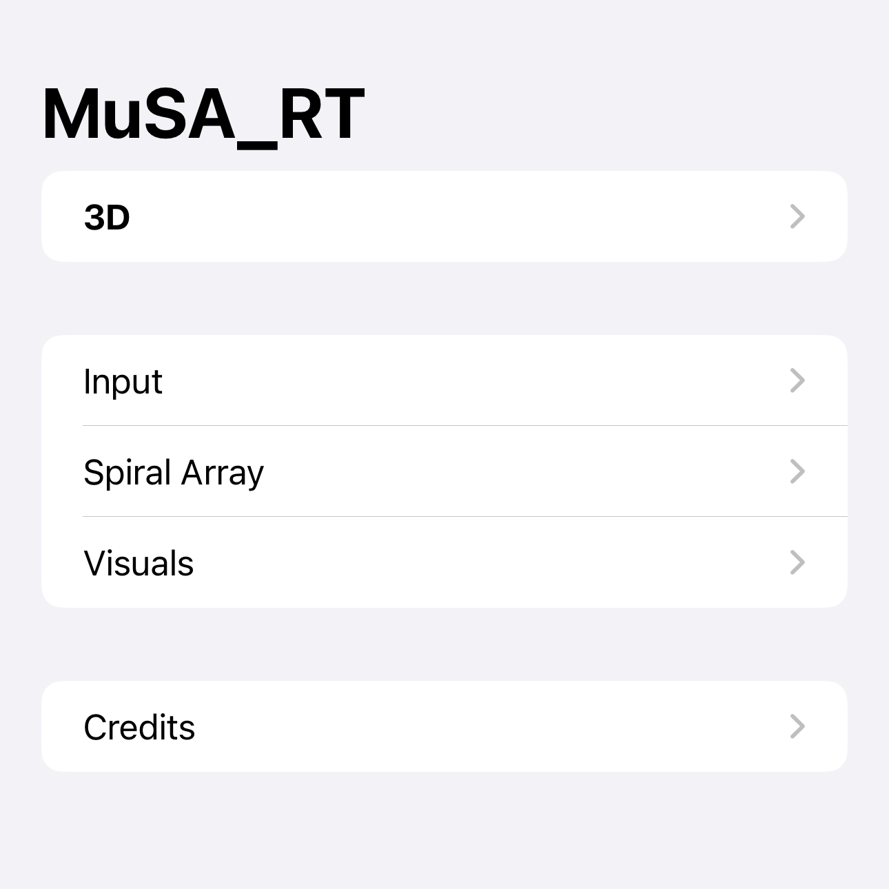
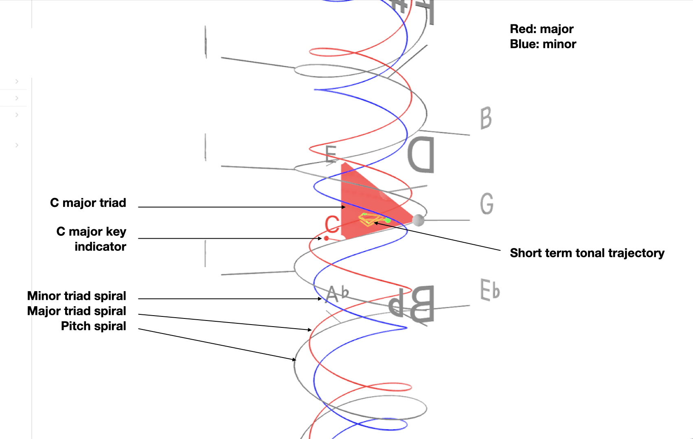

<table align="left" cellpadding="0" cellspacing="0" style="margin-left: auto; margin-right: auto; text-align: left;"><tr><td>

</td>
<td>
MuSA_RT animates a visual representation of tonal patterns - pitches, chords, key - in music as it is being performed.  
</td></tr></table>

MuSA_RT applies music analysis algorithms rooted in [Elaine Chew](https://en.wikipedia.org/wiki/Elaine_Chew)'s [Spiral Array model of tonality](https://en.wikipedia.org/wiki/Spiral_array_model), which also provides the 3D geometry for the visualization space.
The app analyzes the audio signal received from a microphone to determine pitch names, maintain short term and longterm tonal context trackers, each a Center of Effect (CE), and compute the closest triads (3-note chords) and keys as the music unfolds in performance.  
The 3D view presents a graphical representations of these tonal entities in context, smoothly rotating the virtual camera to provide an unobstructed view of the current information. These graphics can also be visualized in an experimental Augmented Reality on compatible devices.

<iframe allow="accelerometer; autoplay; clipboard-write; encrypted-media; gyroscope; picture-in-picture" allowfullscreen="" frameborder="0" height="315" src="https://www.youtube.com/embed/hZ2kJdeRo_Q" width="560"></iframe>

## User Guide (v. 2.1.x)

1. Start the app and give the app access permission to the microphone when prompted
2. Tap on "3D" to navigate to the live 3D visualization screen.
3. Play some music (or sing?): MuSA_RT should start reacting.

To try out the Augmented Reality mode, tap on "AR" (available only if the device supports AR).

Note: MuSA_RT requires a microphone or some audio input device in order to function.

### Visualization: Spiral Array

The Spiral Array Model is a geometric model of tonality invented by Elaine Chew.

Pitch, triads and keys correspond to locations in the 3D space contained inside the outer spiral (pitches). Pitches along the pitch spiral are separated by a perfect 5th; a given pitch is separated from the pitch directly above by a major 3rd. Major triads are therefore compact upright triangles. Similarly, minor triads are compact triangles. Centers of Effect track the long term (key and spelling) and short term (triad) tonal context.

### Settings: Visuals

Select and configure the objects presented in the 3D visualization: pitches, triads, key and associated Center of Effects (CEs).

**Enable/disable auto-rotate**: when enabled, the model smoothly rotates so that the camera faces the active triad (if any)

The **movement** time constant determines how fast the rotation occurs (the higher the time constant, the slower the motion)

Select **dark/light/auto** background mode.

### Settings: Spiral Array

Adjust the parameters of the tonal analysis model.

**Activation threshold**: ignore activation values that are below the threshold (noise)

**Time constants for CE computations**: lower values make the object more responsive, higher values make the objects more stable. **Adapt** affects how the object reacts to signal, **decay** affects how quickly the object fades away in the absence of signal.

For example, to make active triad tracking more responsive, decrease the time constant value for Triad CE Adapt.

### Settings: Audio Input

Select audio input device, visualize input levels for pitch classes.

## Privacy Policy

The MuSA_RT app does not collect or share your personal information.

## Credits

MuSA_RT 2.1.0 Copyright 2023 Alexandre R. J. François.
 
MuSA_RT 1.0 was originally commissioned by Elaine Chew's [MuCoaCo Lab](http://mucoaco.blogspot.com) as part of the [Music on the Spiral Array . Real Time](http://musa-rt.blogspot.com) (MuSA.RT) project, and as companion software to her Springer ORMS Series book [Mathematical and Computational Modeling of Tonality: Theory and Applications (2014)](https://link.springer.com/book/10.1007/978-1-4614-9475-1).

Watch [Elaine Chew talk about using mathematical and software tools to analyze music](https://www.youtube.com/watch?v=4GPwVNPuKuA).

### Audio input

MuSA_RT 2.0 gratefully uses [AudioKit v5](https://github.com/AudioKit/AudioKit) for audio input and low level processing (FFT).
