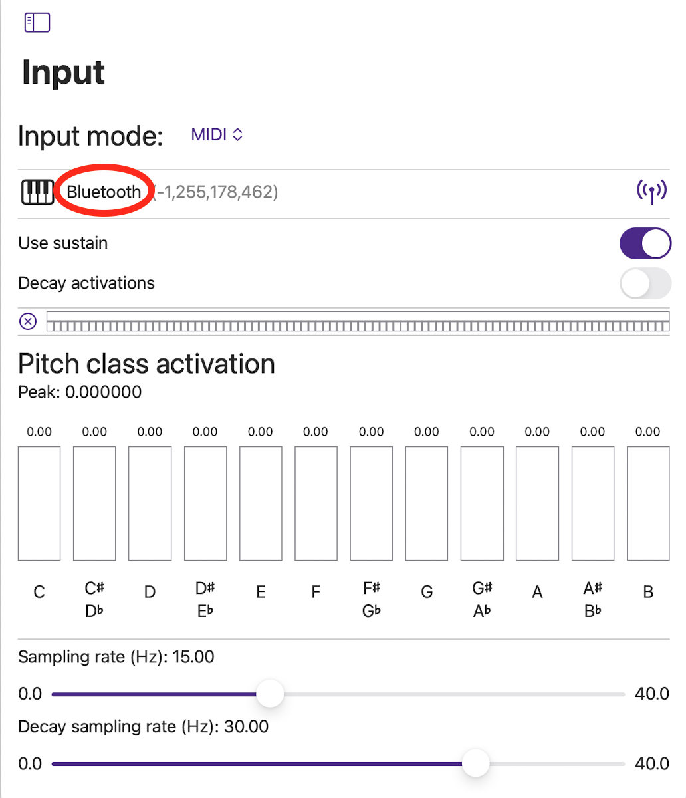
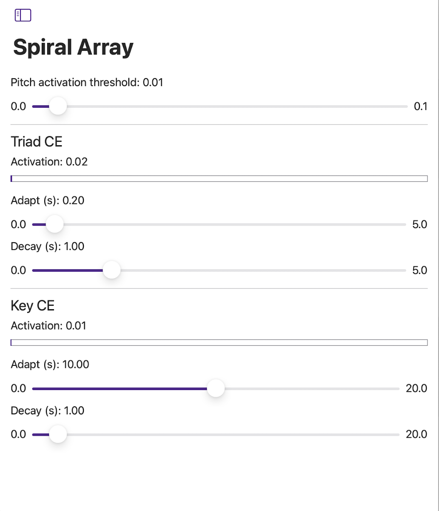
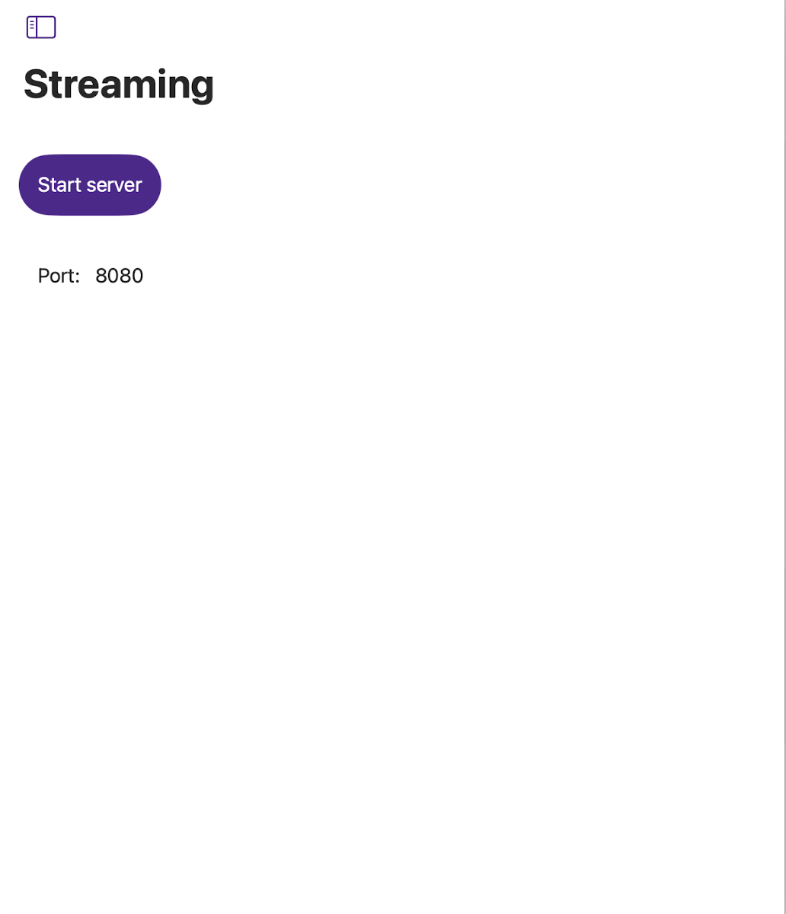

<table align="left" cellpadding="0" cellspacing="0" style="margin-left: auto; margin-right: auto; text-align: left;"><tr><td>

</td>
<td>
MuSA_RT animates a visual representation of tonal patterns - pitches, chords, key - in music as it is being performed.  
</td></tr></table>

MuSA_RT applies music analysis algorithms rooted in [Elaine Chew](https://en.wikipedia.org/wiki/Elaine_Chew)'s [Spiral Array model of tonality](https://en.wikipedia.org/wiki/Spiral_array_model), which also provides the 3D geometry for the visualization space.
The app analyzes the audio signal received from a microphone to determine pitch names, maintain short term and longterm tonal context trackers, each a Center of Effect (CE), and compute the closest triads (3-note chords) and keys as the music unfolds in performance.  
The 3D view presents a graphical representations of these tonal entities in context, smoothly rotating the virtual camera to provide an unobstructed view of the current information. These graphics can also be visualized in an experimental Augmented Reality mode on compatible devices.

<iframe width="560" height="315" src="https://www.youtube.com/embed/I3Ytz6oTPgs?si=nand1MMXGpkJZnsb" title="MuSA_RT video" frameborder="0" allow="accelerometer; autoplay; clipboard-write; encrypted-media; gyroscope; picture-in-picture; web-share" referrerpolicy="strict-origin-when-cross-origin" allowfullscreen></iframe>

&nbsp;

## User Guide (v. 3.1)

1. Start the app and give the app access permission to the microphone when prompted
2. Tap on "3D" to navigate to the live 3D visualization screen.
3. Play some music (or sing?): MuSA_RT should start reacting.

To try out the Augmented Reality mode, tap on "AR" (available only if the device supports AR).

Note: MuSA_RT requires a microphone or some audio input device in order to function in Audio mode, or a MIDI input device to function in MIDI mode. MuSA_RT does not generate sound.

### Spiral Array

The Spiral Array Model is a geometric model of tonality invented by Elaine Chew.

Pitch, triads and keys correspond to locations in the 3D space contained inside the outer spiral (pitches). Pitches along the pitch spiral are separated by a perfect 5th; a given pitch is separated from the pitch directly above by a major 3rd. Major triads are therefore compact upright triangles. Similarly, minor triads are compact triangles. Centers of Effect track the long term (key and spelling) and short term (triad) tonal context.

### Input

Select and configure **FFT** (live audio), **FFT from file**, **MIDI** or **Remote** input.

#### FFT

Select an audio input device from the dropdown list.  
Visualize activation levels for pitch classes.

#### FFT from file

Tap on the note icon to open a file picker and select an audio file for input.  
When the file is ready use the play, pause and stop buttons to control playback.  
Tap the note icon to select another file.

#### MIDI

View connected MIDI devices. To connect to a Bluetooth MIDI device, tap the antenna button. Set the Bluetooth device in pairing mode. When the device appears in the list, tap the "Not Connected" label to connect.

For input activation modeling, choose whether to use sustain pedal signal, and whether to apply an activation decay.
The time constant determines how fast the activation decays (the larger the time constant, the slower the decay).

**Sampling rate**: the frequency of sampling MIDI state for tonality analysis. Reducing the sampling rate reduces the computing load.

**Decay sampling rate**: the frequency of update for decaying activation; only affects smoothness of decay, does not affect the dynamics set via the time constant.

#### Remote

Connect to a [MuSA_RT streaming server](#streaming) to render the results of the analysis performed remotely. Server and receiving devices must be connected to the same local network.

Tap the QR code icon to scan the QR code on the [Streaming](#streaming) screen on the serving device to connect directly.  
Alternately, enter the server URL manually and tap the antenna to connect.  
When connected, tap the antenna again to disconnect.

### Visuals Settings

#### Pitch / Triad / Key

Select and configure the objects presented in the 3D visualization: pitches, triads, key and associated Center of Effects (CEs).

#### Orientation

**Face labels inward**: when enabled, the pitch labels face towards the axis of the spirals and if **orient** is on, the spiral array rotates to show the active triad on the far side (from the viewpoint adopted in the 3D view), like in the original MuSA_RT. If this switch is off, the labels face outward and the active triad would be displayed in front, a setting more suitable for the AR scenario.

**Orient**: when enabled, the model smoothly rotates so that the currently active triad (if any) faces the "front" of the array in AR (corresponds to the user's viewpoint in 3D mode)

**Adjust height**: when enabled, the Spiral Array smoothly moves vertically so the active triad remains centered at a reference height, and remains vertically centered in the 3D view.

The **movement** time constant determines how fast the motion occurs (the larger the time constant, the slower the motion)

#### Background

Select **dark/light/auto** background mode.

### Spiral Array Settings

Adjust the parameters of the tonal analysis model.

**Activation threshold**: ignore activation values that are below the threshold (noise)

**Time constants for CE computations**: lower values make the object more responsive, higher values make the objects more stable. **Adapt** affects how the object reacts to signal, **decay** affects how quickly the object fades away in the absence of signal.  
For example, to make active triad tracking more responsive, decrease the time constant value for Triad CE Adapt.

### Streaming

Stream local analysis results to connected MuSA_RT instances in remote input mode.
Server and clients must be connected to the same local network.

Start server. The screen shows the URL for the server, the number of connected clients.

Disable local rendering if not needed to reduce computation load on the serving device.  
Enable streaming instant center of effect data if desired. This is a high frequency event that is only needed if the clients opt to display the instant CE.

Scan the QR code on a client device in [remote input mode](#remote) to connect directly.

## Privacy Policy

The MuSA_RT app does not collect or share your personal information.

## Credits

MuSA_RT Copyright 2012-2024 Alexandre R. J. François.

MuSA_RT 1.0, released in 2012, was originally commissioned by Elaine Chew's [MuCoaCo Lab](http://mucoaco.blogspot.com) as part of the [Music on the Spiral Array . Real Time](http://musa-rt.blogspot.com) (MuSA.RT) project, and as companion software to her Springer ORMS Series book [Mathematical and Computational Modeling of Tonality: Theory and Applications (2014)](https://link.springer.com/book/10.1007/978-1-4614-9475-1).

Watch [Elaine Chew talk about using mathematical and software tools to analyze music](https://www.youtube.com/watch?v=4GPwVNPuKuA).

### Libraries

MuSA_RT gratefully uses the following libraries:

- [AudioKit v5](https://github.com/AudioKit/AudioKit) for audio and MIDI input and for low level audio processing (FFT)
- [CodeScanner](https://github.com/twostraws/CodeScanner) for QR code scanning
