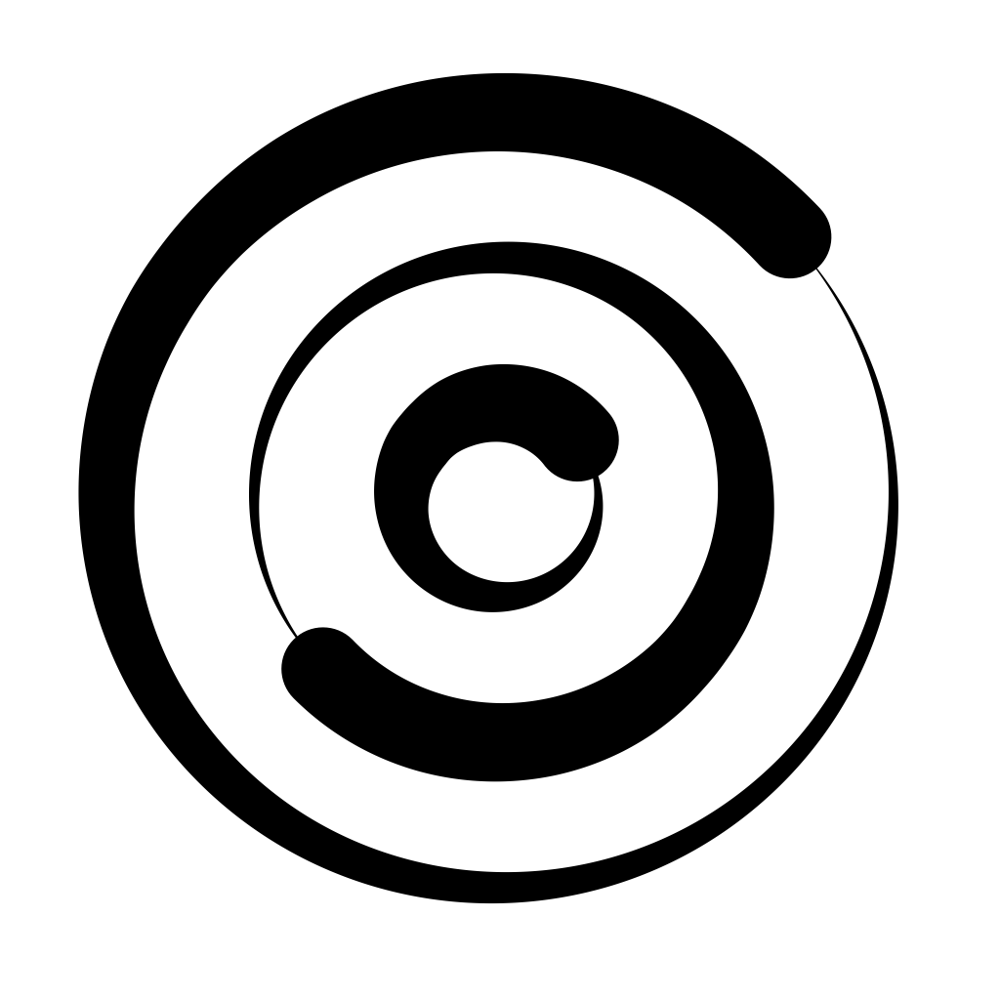
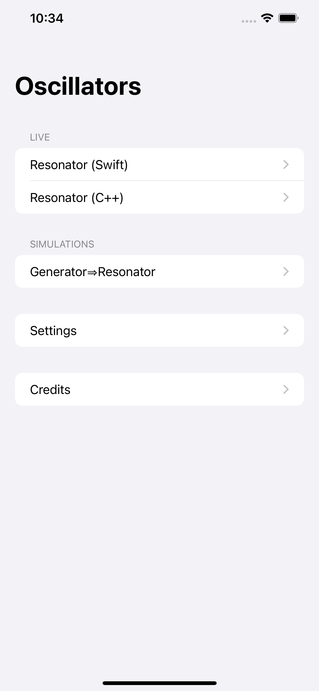
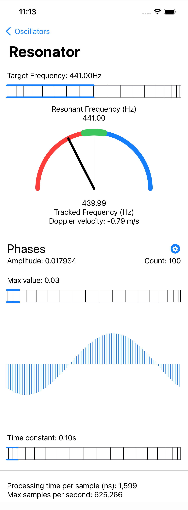
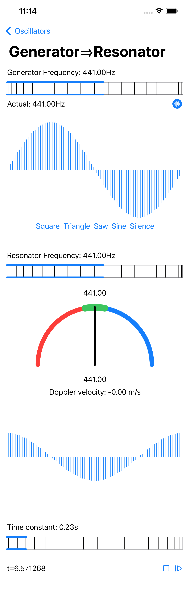

<table align="left" cellpadding="0" cellspacing="0" style="margin-left: auto; margin-right: auto; text-align: left;"><tr><td>

</td>
<td>
Oscillators offers educational tools for experimenting with digital resonators.
This app particularly encourages live experimentation with microphone input.
</td></tr></table>

**By design, the oscillators in this app can only be tuned to frequencies that correspond to a period length that is a multiple of the sample duration (dictated by the sampling rate of the signal).**
For example, for a sampling rate of 44.1kHz, an oscillator (generator or resonator) can be tuned exactly at 441Hz. However, if the requested frequency is for example 440Hz, the oscillator will be tuned to the closest frequency meeting the requirements, in this case 440Hz.

## Demonstrations

<iframe width="560" height="315" src="https://www.youtube.com/embed/videoseries?list=PLVcB_ABiKC_djwV2PXnSCWkvXOXt8PRMC" title="YouTube video player" frameborder="0" allow="accelerometer; autoplay; clipboard-write; encrypted-media; gyroscope; picture-in-picture" allowfullscreen></iframe>

 

## User Guide

### Quick Start

1. Start the app and allow access to the microphone when prompted (needed for live sound processing)
2. Tap on "Resonator" or "Resonator C++" to navigate to a live input resonator screen.
3. Play some music (or sing?) and see what happens.

The app offers a number of tools, some use live microphone input, some are offline experiments. Each tool is described below.

The app also introduces a new [Wheel Control](https://github.com/alexandrefrancois/WheelControl) for setting floating point values within a range. This control is designed to afford finer precision than the traditional slider bar by utilizing a "wheel with gears" metaphore: drag the wheel to adjust the value, tap on the wheel to cycle through the gears/speeds.

### Live

Live audio processing tools, use the microphone as input. This requires running on a device that has at least one microphone / audio input. Go to the **Settings** screen to display available audio sources and select the one to use.

#### Resonator / C++

Feed the audio from the microphone to a resonator. Visualize the resulting amplitude at all phases, estimate the observed frequency, calculate corresponding Doppler velocity.

The same tool is offered with both the Swift (manually managed memory with unsafe pointers) and C++ implementations, suitable for perfoemance comparison purposes.

**Target Frequency**: the *desired* resonant frequency, adjust with the wheel control (drag the wheel to adjust the value, tap on the wheel to cycle through the gears/speeds).

**Resonant frequency**: the *actual* resonant frequency, i.e. the closest frequency that corresponds to a period length that is a multiple of the sample duration (dictated by the sampling rate of the signal).

**Tracked frequency**: an estimate of the frequency present in the input signal that causes the resonance; most meaningful in the case of a single frequency signal.

**Doppler velocity**: the Doppler velocity estimated from the difference between the resonant frequency and the observed frequency. A negative value means the observer and source are getting closer.

**Phases graph**: a plot of the amplitude of oscillations at each phase.

- Tap on the gear icon to reveal/hide the scaling control (adjust the maximum amplitude value for display with the wheel)
- Amplitude: the maximum amplitude value across the phases (taken as the amplitude of resonant oscillations for the resonator)
- Count: the number of phases computed (also the number of samples in the resonator's period)

**Time constant**: the parameter that regulates the dynamics of the low-pass filter through which individual contributions from each audio sample are accumulated over time in the resonator. The shorter the time constant the more reactive the resonator. Adjust with the wheel control (drag the wheel to adjust the value, tap on the wheel to cycle through the gears/speeds).

**Performance measurements**: some computation time measurements for performance comparison purposes.
- Processing time per sample (in ns): the average time taken to process one audio sample
- Max samples per second: the inverse of the processing time per sample expressed in seconds, an extrapolation that gives an idea of what can be achieved in real time (if the sampling rate is 44.1kHz, the machine must be able to process at least 44,100 samples per second, and that does not take into account any utilization of the result in an app)

### Simulations

Simulation tools for experimenting in a more controlled way.

#### Generator => Resonator

Feed the output of a generator to a resonator. This is an offline simulation that can be controlled (play/pause).

**Simulation controls**: a capsule pinned at the bottom of the screen contains the current timestamp (in s), a play/pause toggle and a step button which advances the simulation by one sample duration.

**Generator frequency**: the *desired* generator frequency, adjust with the wheel control (drag the wheel to adjust the value, tap on the wheel to cycle through the gears/speeds).

**Actual**: the *actual* generator frequency, i.e. the closest frequency that corresponds to a period length that is a multiple of the sample duration (dictated by the sampling rate of the signal).

**Generator waveform**: tap on the gear icon to show/hide the waveform graph and selection buttons: Square, Triangle, Saw, Sine or Silence.

**Resonator frequency**: the *desired* resonant frequency, adjust with the wheel control (drag the wheel to adjust the value, tap on the wheel to cycle through the gears/speeds).

**Gauge display**: the *actual* resonant frequency, i.e. the closest frequency that corresponds to a period length that is a multiple of the sample duration (dictated by the sampling rate of the signal).

**Phases**: a plot of the amplitudes at each phase.

**Time constant**: the parameter that regulates the dynamics of the low-pass filter through which individual contributions from each audio sample are accumulated over time in the resonator. The shorter the time constant the more reactive the resonator. Adjust with the wheel control (drag the wheel to adjust the value, tap on the wheel to cycle through the gears/speeds).

## Privacy Policy

Fun with Oscillator does not collect or share your personal information. In particular, any audio captured from the microphone is only processed in real time for visualization purposes. The app does not record or transmit any of it.

## Credits

Oscillators Copyright 2022 Alexandre R. J. François.
 
- Oscillators gratefully uses [AudioKit v5](https://github.com/AudioKit/AudioKit) for audio input.
- Oscillators uses [Wheel Control](https://github.com/alexandrefrancois/WheelControl) to afford better precision than the standard slider when adjusting a value within a range.