<section class="media-block media-block--plain">
  

    
    
  

  

    
Oscillators

    
Educational tools for experimenting with digital resonators, especially in the context of audio analysis and live microphone input.

  

</section>

<section class="media-block">
  

    <iframe width="560" height="315" src="https://www.youtube.com/embed/videoseries?list=PLVcB_ABiKC_djwV2PXnSCWkvXOXt8PRMC" title="YouTube video player" frameborder="0" allow="accelerometer; autoplay; clipboard-write; encrypted-media; gyroscope; picture-in-picture" allowfullscreen></iframe>
  

  

    
Live resonator experiments.

    <ul class="feature-list">
      <li>Demonstrates the use of the <a href="../Resonate">Resonate</a> algorithm for efficient, high temporal resolution spectral analysis of audio signal.</li>
      <li>Offers live tools for exploring resonators, resonator banks, spectrograms, chromagrams, MFCCs, and controlled simulations.</li>
      <li>Encourages hands-on experimentation with microphone input.</li>
    </ul>
  

</section>

## User Guide

Version 5.0

### Quick Start

1. Start the app and allow access to the microphone when prompted (needed for live sound processing)
2. Tap on "Tracking Spectrogram" or "Spectrogram" to navigate to a live input screen.
3. Play some music (or whistle, or sing) and see what happens.

The app offers a number of tools, some use live microphone input, some are offline experiments. Each tool is described below.

This app demonstrates the most significant features of the open source [Oscillators](https://github.com/alexandrefrancois/Oscillators) Swift package: efficient implementations of sinusoidal resonators tuned at arbitrary frequencies, tracking resonators, and banks of such resonators, with vectorized SIMD accelerated implementation.
Such banks implement the [_Resonate_](/Resonate) algorithm for efficient, high temporal and frequency resolution spectral analysis of audio signal, as illustrated in the [Tracking Spectrogram](#tracking-spectrogram), [Spectrogram](#spectrogram), [Tracking Chromagram](#chromagrams), [Chromagram](#chromagrams) and [MFCCs](#mfccs) tools.

The app makes use of a new [Wheel Control](https://github.com/alexandrefrancois/WheelControl) for setting floating point values within a range. This control is designed to afford finer precision than the traditional slider bar by utilizing a "wheel with gears" metaphor: drag the wheel to adjust the value, double-tap on the wheel to cycle through the gears/speeds.

Live audio processing tools, use the microphone as input. This requires running on a device that has at least one microphone / audio input. On any live screen, tap on the gear icon in the top right to open the corresponding [settings screen](#settings-screens), which lists available audio input devices and allows selecting which one to use.

**Frequency Tracking**
| [Tracking Spectrogram](#tracking-spectrogram)
| [Self-Tuning Bank](#self-tuning-bank)
| [Tracking Resonator](#tracking-resonator)  
**Fixed Frequencies**
| [Spectrogram](#spectrogram)
| [Instantaneous Frequencies](#instantaneous-frequencies)
| [Frequency Analysis](#frequency-analysis)
| [Resonator](#resonator)  
**Audio Features**
| [Tracking Chromagram](#chromagrams)
| [Chromagram](#chromagrams)
| [MFCCs](#mfccs)  
**Simulations**
| [Generator => Resonator](#generator--resonator)

### Resonators

#### Resonator

The audio signal from the microphone is fed to a resonator. This tool offers a visualization of the resonator's amplitude, the phase between the resonator's sine wave and the input signal when resonance occurs, an estimate of the observed frequency from the observed phase drift, and the Doppler velocity corresponding to the difference between resonant and tracked frequencies, assuming a source that emits a signal at the resonator's resonant frequency.

  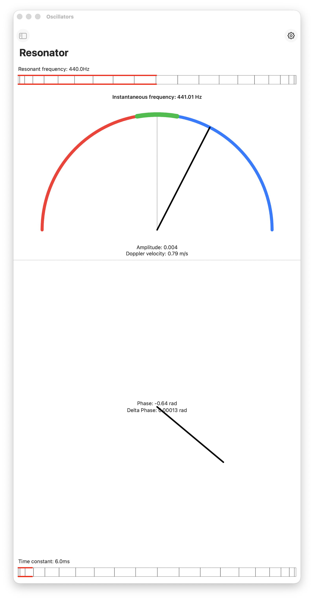

**Resonant frequency**: the resonant frequency of the resonator.

**Tracked frequency**: an estimate of the frequency present in the input signal that causes the resonance; most meaningful in the case of a single frequency signal.

**Doppler velocity**: the Doppler velocity estimated from the difference between the resonant frequency and the observed frequency. A negative value means the observer and source are getting closer.

**Phase**: the estimated phase difference between the input signal and the resonator's sine wave.

**Time constant**: the parameter that regulates the dynamics of the low-pass filter through which individual contributions from each audio sample are accumulated over time in the resonator. The shorter the time constant the more reactive the resonator. Adjust with the wheel control (drag the wheel to adjust the value, double-tap on the wheel to cycle through the gears/speeds).

#### Tracking Resonator

This tool offers a visualization of the tracking resonator's amplitude plotted on a frequency axis (logarithmic scale), at the tracked resonant frequency, or the resonator's natural frequency (root anchor). When the resonator's amplitude is above a minimum threshold, the resonator's resonant frequency tracks the instantaneous frequency computed from the estimated phase derivative.

  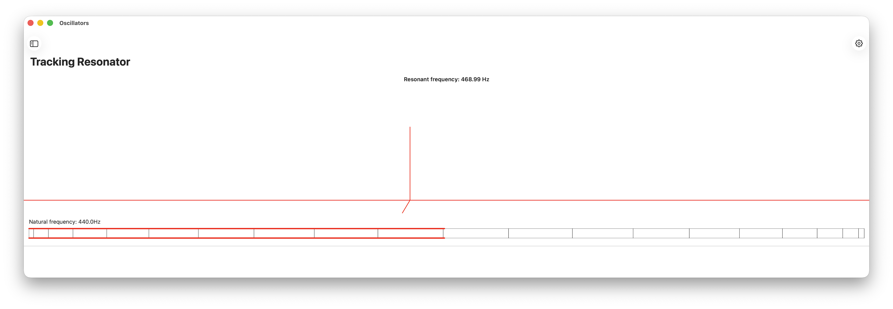

**Resonant frequency**: the current resonant frequency of the resonator.

**Natural frequency**: the natural (rest) resonant frequency of the resonator.

### Resonator Banks

#### Frequency Analysis

For frequency analysis, the resonators in the bank are tuned to a log frequency scale (100 frequencies from 32.7Hz to 9955.1Hz, 12 per octave), organized from lowest to highest frequency.

  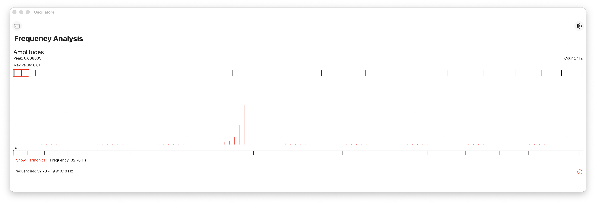

The amplitude graph plots the current amplitude of each resonator in the bank. The resonators are ordered by increasing frequency from left to right on the horizontal axis.

- Peak: the current maximum amplitude value across the resonators in the bank.
- Count: the number of resonators in the bank.

**Max value**: controls the value range for amplitude plotting.
Adjust with the wheel control (drag the wheel to adjust the value, double-tap on the wheel to cycle through the gears/speeds).

**Frequency index**: graph frequency value at the index.
Move line with the wheel control (drag the wheel to adjust the value, double-tap on the wheel to cycle through the gears/speeds).

**Show harmonics**: display additional markers at the first 5 multiples of the frequency value at root index.

**Frequencies**: Frequency range covered by the bank and optional list of individual frequency tuning for each resonator.

#### Instantaneous Frequencies

In this visualization, the resonators in the bank are tuned to a log frequency scale (100 frequencies from 32.7Hz to 9955.1Hz, 12 per octave), organized from lowest to highest frequency.
The main graph plots the opposite of each resonator’s magnitude at the resonator’s resonant frequency position on the x-axis (i.e. an inverted version of the Frequency Analysis graph), and the resonators’ magnitudes at the instantaneous frequency position.
Below this main graph is a plot of the computed phase derivatives for each resonator, also plotted at the resonator's resonant frequency along the x-axis.

Resonators that have significant magnitude, i.e. those whose resonant frequency is in the vicinity of the input signal’s frequency, agree on the correctly estimated instantaneous frequency.

  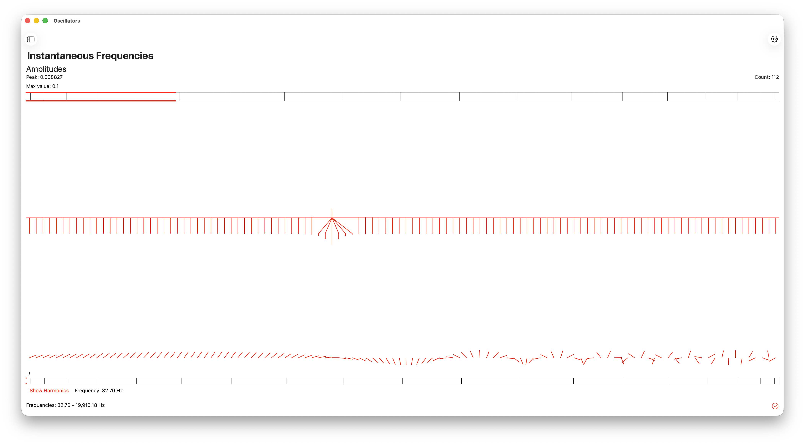

- Peak: the current maximum amplitude value across the resonators in the bank.
- Count: the number of resonators in the bank.

**Max value**: controls the value range for amplitude plotting.
Adjust with the wheel control (drag the wheel to adjust the value, double-tap on the wheel to cycle through the gears/speeds).

**Frequency index**: graph frequency value at the index.
Move line with the wheel control (drag the wheel to adjust the value, double-tap on the wheel to cycle through the gears/speeds).

**Show harmonics**: display additional markers at the first 5 multiples of the frequency value at root index.

**Frequencies**: Frequency range covered by the bank and optional list of individual frequency tuning for each resonator.

#### Self Tuning Bank

A self-tuning bank is composed of tracking resonators.
In this analysis tool, the tracking resonators natural frequencies are set on a log frequency scale (100 frequencies from 32.7Hz to 9955.1Hz, 12 per octave), organized from lowest to highest frequency.
The main graph plots the tracking resonators' magnitudes at the resonators' resonant frequency position on the x-axis, anchored at the resonators’ natural frequency position.

  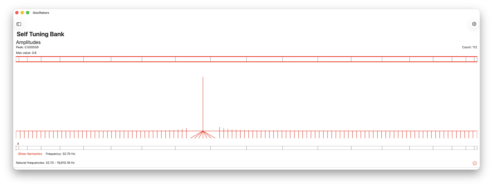

- Peak: the current maximum amplitude value across the resonators in the bank.
- Count: the number of resonators in the bank.

**Max value**: controls the value range for amplitude plotting.
Adjust with the wheel control (drag the wheel to adjust the value, double-tap on the wheel to cycle through the gears/speeds).

**Frequency index**: graph frequency value at the index.
Move line with the wheel control (drag the wheel to adjust the value, double-tap on the wheel to cycle through the gears/speeds).

**Show harmonics**: display additional markers at the first 5 multiples of the frequency value at root index.

**Frequencies**: Frequency range covered by the bank and optional list of individual frequency tuning for each resonator.

### Spectrograms

#### Spectrogram

The spectrogram plots the power (squared amplitude) levels of the resonators in a resonator bank over time.
Resonators are independently tuned according to the selected frequency scale, and the time constants are set with the heuristic $$\alpha_f = 1-e^{-\Delta t\frac{f}{log(1+f)} }$$.

Spectrogram - Decibels:

  

Spectrogram - Log Compression:

  

In the plot, frequencies are represented on the vertical axis, lowest frequency at the bottom, highest at the top. Time flows on the horizontal axis, to the left of the screen. Power levels are color mapped (logarithmic scale) to assign brighter colors to higher power.

**Frequency label**: spectrogram frequency value at the level indicated by the line.
Move line with the wheel control (drag the wheel to adjust the value, double-tap on the wheel to cycle through the gears/speeds).

**Frequency scale**: The resonators in the bank are tuned to the selected frequency scale. In the current version, frequency numbers and range are preset.

- Linear:
- Logarithmic (default): 100 frequencies from 32.7Hz to 9955.1Hz, 12 per octave.
- Mel: 127 frequencies from 23.75 to 8000Hz.

**Frequencies**: Frequency range covered by the bank and optional list of individual frequency tuning for each resonator.

**Hop length**: controls the time interval between vertical slices of the spectrogram, expressed in number of samples.
The lower the value, the higher the time resolution of the spectrogram display. Forced to a multiple of the input frame size.
Adjust with the wheel control (drag the wheel to adjust the value, double-tap on the wheel to cycle through the gears/speeds).

**Rendering**: Decibels or log compression scale.

**Max value** (dB rendering only): controls the maximum power value for dB conversion.
Adjust with the wheel control (drag the wheel to adjust the value, double-tap on the wheel to cycle through the gears/speeds).

**Spectrogram dB cutoff** (dB rendering only): controls the dB value below which values are mapped to the lowest value in the color map.
Adjust with the wheel control (drag the wheel to adjust the value, double-tap on the wheel to cycle through the gears/speeds).

**Compression factor** (log compression rendering only): parameter for log compression rendering.
Adjust with the wheel control (drag the wheel to adjust the value, double-tap on the wheel to cycle through the gears/speeds).

**Normalize powers**: Apply adaptive total (sum) or maximum (max) power normalization to power values.
Adjust with the wheel control (drag the wheel to adjust the value, double-tap on the wheel to cycle through the gears/speeds).

#### Tracking Spectrogram

The tracking spectrogram plots the power (squared amplitude) levels of the resonators in a self tuning resonator bank over time.
Resonators dynamically track the frequencies present in the input signal, and the time constants are set with the heuristic $$\alpha_f = 1-e^{-\Delta t\frac{f}{log(1+f)} }$$.

  

In the plot, frequencies are represented on the vertical axis on a logarithmic scale, lowest frequency at the bottom, highest at the top. Time flows on the horizontal axis, to the left of the screen. Power levels are color mapped (logarithmic scale) to assign brighter colors to higher power.

**Frequency label**: spectrogram frequency value at the level indicated by the line.
Move line with the wheel control (drag the wheel to adjust the value, double-tap on the wheel to cycle through the gears/speeds).

**Frequencies**: Natural frequency range covered by the bank and optional list of individual natural frequency tuning for each resonator.

**Hop length**: controls the time interval between vertical slices of the spectrogram, expressed in number of samples.
The lower the value, the higher the time resolution of the spectrogram display. Forced to a multiple of the input frame size.
Adjust with the wheel control (drag the wheel to adjust the value, double-tap on the wheel to cycle through the gears/speeds).

**Rendering**: Decibels or log compression scale.

**Max value** (dB rendering only): controls the maximum power value for dB conversion.
Adjust with the wheel control (drag the wheel to adjust the value, double-tap on the wheel to cycle through the gears/speeds).

**Spectrogram dB cutoff** (dB rendering only): controls the dB value below which values are mapped to the lowest value in the color map.
Adjust with the wheel control (drag the wheel to adjust the value, double-tap on the wheel to cycle through the gears/speeds).

**Compression factor** (log compression rendering only): parameter for log compression rendering.
Adjust with the wheel control (drag the wheel to adjust the value, double-tap on the wheel to cycle through the gears/speeds).

### Audio Features

#### Chromagrams

Chroma are important audio features in many Music Information Retrieval systems, for such tasks as audio and score alignment, and artist identification. Other real-time uses of chroma information include analysis visualization systems, and performance systems that require tonal context estimation.
The chromagram is computed from the log frequency spectrogram by summing up power contributions in each time slice across the spectrum into 12 semi-tone bands, in effect dropping octave information to capture tonality. The tracking chromagram is similarly computed from a frequency tracking spectrogram, computed with a self-tuning resonator bank.
The right part (stack) shows the current temporal slice of the spectrogram reorganized into pitch classes on the vertical axis, from C (bottom) to E (top), with octaves on the horizontal axis (increasing left to right). The left part is the chromagram, with same pitch classes on the vertical axis and time on the horizontal axis. Both are rendered with log compression.

Chromagram:

  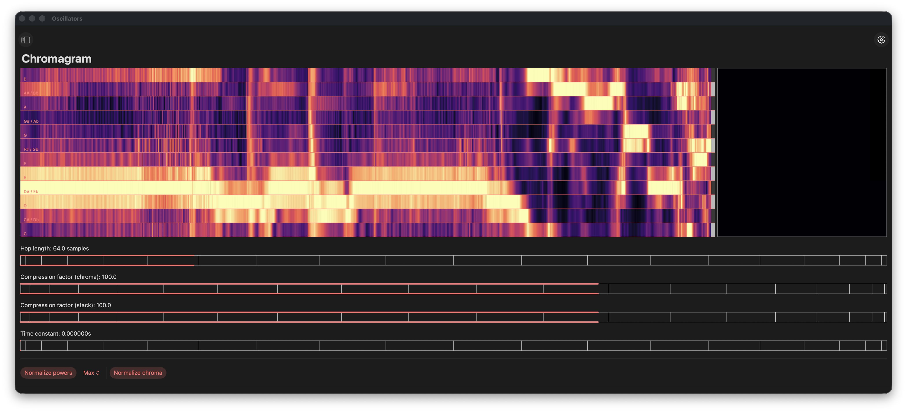

Tracking chromagram:

  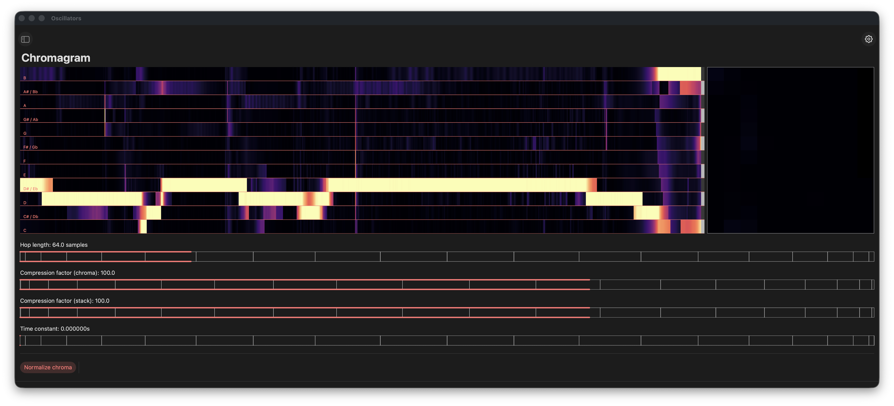

**Hop length**: controls the time interval between vertical slices of the spectrogram, expressed in number of samples.
The lower the value, the higher the time resolution of the spectrogram display. Forced to a multiple of the input frame size.
Adjust with the wheel control (drag the wheel to adjust the value, double-tap on the wheel to cycle through the gears/speeds).

**Compression factor (chroma)**: parameter for log compression rendering of chroma.
Adjust with the wheel control (drag the wheel to adjust the value, double-tap on the wheel to cycle through the gears/speeds).

**Compression factor (stack)**: parameter for log compression rendering of stack.
Adjust with the wheel control (drag the wheel to adjust the value, double-tap on the wheel to cycle through the gears/speeds).

**Time constant**: controls the time constant for chroma smoothing, to capture tonal context. The default is no smoothing.
Adjust with the wheel control (drag the wheel to adjust the value, double-tap on the wheel to cycle through the gears/speeds).

**Normalize powers**: Apply adaptive total (sum) or maximum (max) power normalization to power values.

**Normalize chroma**: Divide chroma values by the maximum in each time slice. When on, chroma values are color mapped linearly. When off, chroma values are converted to dB (log scale as for the spectrograms).

**Decorrelate resonators**: Apply decorrelation weights from bank frequency responses to power values (includes equalization).

**Equalize powers**: Apply equalization from bank frequency responses to power values (only if decorrelation is not active).

#### MFCCs

MFCCs are audio signal features that have been successfully used in speech recognition and speaker identification. In music, they characterize timbre, and have been used in Music Information Retrieval tasks such as genre classification and similarity estimation. They are also used in some real-time improvisation systems.
MFCCs are the amplitudes of the spectrum of the mel frequency spectrogram of the audio signal, obtained by applying a Direct Cosine Transform to each time slice of the log power mel-frequency spectrogram.
The plot shows coefficients 0-21, from bottom on the vertical axis, as a function of time (horizontal axis). MFCC values are mapped to a dB color scale, from darker blue for negative values, through white for 0, and to darker red for positive values.

  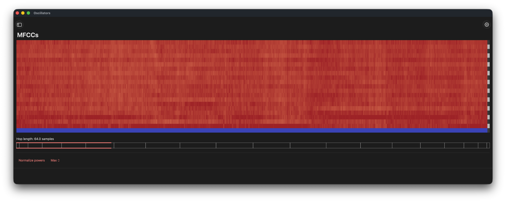

**Hop length**: controls the time interval between vertical slices of the spectrogram, expressed in number of samples.
The lower the value, the higher the time resolution of the spectrogram display. Forced to a multiple of the input frame size.
Adjust with the wheel control (drag the wheel to adjust the value, double-tap on the wheel to cycle through the gears/speeds).

**Normalize powers**: Apply adaptive total (sum) or maximum (max) power normalization to power values.

### Simulations

Simulation tools for experimenting in a more controlled way.

#### Generator => Resonator

Feed the output of a generator to a resonator. This is an offline simulation that can be controlled (play/pause).

**Simulation controls**: a capsule pinned at the bottom of the screen contains the current timestamp (in s), a play/pause toggle and a step button which advances the simulation by one sample duration.

  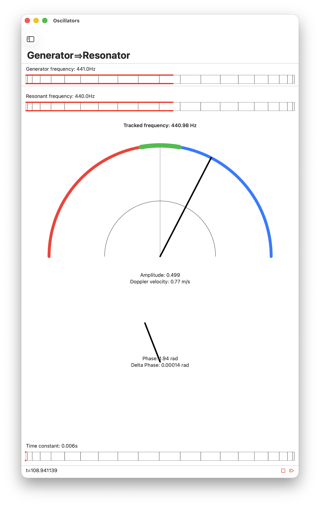

**Generator frequency**: the generator frequency, adjust with the wheel control (drag the wheel to adjust the value, double-tap on the wheel to cycle through the gears/speeds). The generator produces a sinusoidal signal.

**Resonator frequency**: the resonant frequency of the resonator, adjust with the wheel control (drag the wheel to adjust the value, double-tap on the wheel to cycle through the gears/speeds).

**Tracked frequency**: an estimate of the frequency of the sine wave signal produced by the generator.

**Doppler velocity**: the Doppler velocity estimated from the difference between the resonant frequency and the observed frequency. A negative value means the observer and source are getting closer.

**Phase**: the estimated phase difference between the input signal and the resonator's sine wave. This quantity is constant if the generated signal's frequency is equal to the resonator's resonant frequency. If the frequency of the generated signal is close to that of the resonance frequency of the resonator, the rate of change in the estimated phase difference can be used to compute the exact frequency of the generated signal ("tracked frequency").

**Time constant**: the parameter that regulates the dynamics of the low-pass filter through which individual contributions from each audio sample are accumulated over time in the resonator. The shorter the time constant the more reactive the resonator. Adjust with the wheel control (drag the wheel to adjust the value, double-tap on the wheel to cycle through the gears/speeds).

### Setting Screens

The live tools feature dedicated Setting sheets, accessed via the gear icon in the top right of the screen.

Resonator settings:

  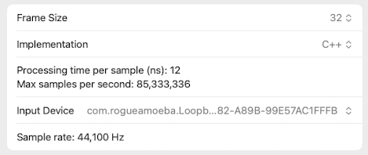

Resonator bank settings:

  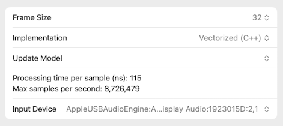

**Frame size**: The frame size (number of samples) for audio input processing. This also sets the minimum and possible values of hop length for spectrogram-based features.

**Implementation selection**: resonators and resonator banks come in Swift and C++ implementations, for direct performance comparison.

**Update model**: The resonator banks offer two update models (for the non-vectorized implementation):

- Sequential: calls the update function for each resonator sequentially
- Concurrent: calls update for each resonator concurrently, with update calls grouped in a fixed number of concurrent tasks

The vectorized implementations perform updates in parallel, leveraging the SIMD architecture where available.

**Performance measurements**:

- Processing time per sample (in ns): the average time taken to process one audio sample
- Max samples per second: the inverse of the processing time per sample expressed in seconds, an extrapolation that gives an idea of what can be achieved in real time (if the sampling rate is 44.1kHz, the machine must be able to process at least 44,100 samples per second, and that does not take into account any utilization of the result in an app)

**Input device**: Select the audio device to use for live input.

**Sample rate**: The input (and processing) sample rate (defaults depends on platform, cannot be changed for now).

## Privacy Policy

Fun with Oscillator does not collect or share your personal information. In particular, any audio captured from the microphone is only processed in real-time for visualization purposes. The app does not record or transmit any of it.

## Credits

Oscillators Copyright 2022-2026 Alexandre R. J. François.

- Oscillators demonstrates the most significant features of the open source [Oscillators](https://github.com/alexandrefrancois/Oscillators) Swift package.
- Oscillators gratefully uses [AudioKit v5](https://github.com/AudioKit/AudioKit) for audio input.
- Oscillators uses [Wheel Control](https://github.com/alexandrefrancois/WheelControl) to afford better precision than the standard slider when adjusting a value within a range.
