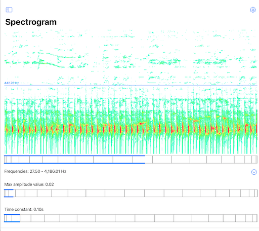
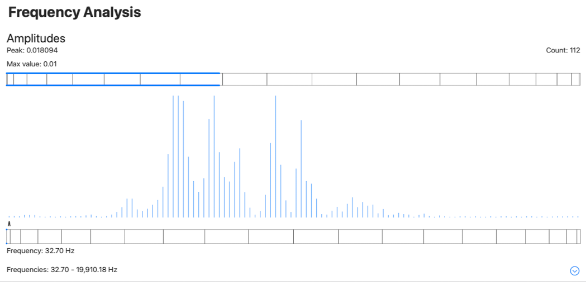
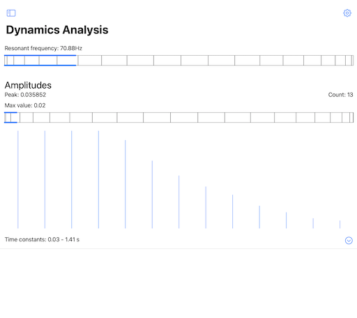
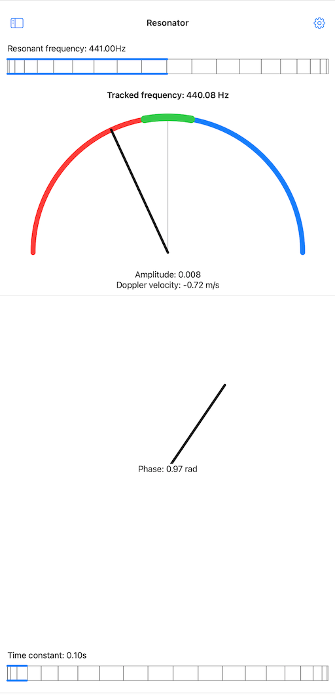
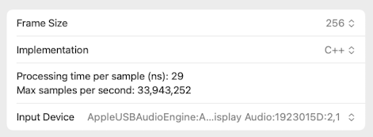

<table align="left" cellpadding="0" cellspacing="0" style="margin-left: auto; margin-right: auto; text-align: left;"><tr><td>

</td>
<td>
Oscillators offers educational tools for experimenting with digital resonators, especially in the context of audio analysis.
This app particularly encourages live experimentation with microphone input.
</td></tr></table>

## Demonstrations

<iframe width="560" height="315" src="https://www.youtube.com/embed/videoseries?list=PLVcB_ABiKC_djwV2PXnSCWkvXOXt8PRMC" title="YouTube video player" frameborder="0" allow="accelerometer; autoplay; clipboard-write; encrypted-media; gyroscope; picture-in-picture" allowfullscreen></iframe>

 

## User Guide

Version 3.0

### Quick Start

1. Start the app and allow access to the microphone when prompted (needed for live sound processing)
2. Tap on "Spectrogram" or "Frequency analysis" to navigate to a live input screen.
3. Play some music (or sing?) and see what happens.

The app offers a number of tools, some use live microphone input, some are offline experiments. Each tool is described below.

This app demonstrates the most significant features of the open source [Oscillators](https://github.com/alexandrefrancois/Oscillators) Swift package: efficient implementations of sinusoidal resonators tuned at arbitrary frequencies, and banks of such resonators, with vectorized SIMD accelerated implementation.

The app makes use of a new [Wheel Control](https://github.com/alexandrefrancois/WheelControl) for setting floating point values within a range. This control is designed to afford finer precision than the traditional slider bar by utilizing a "wheel with gears" metaphore: drag the wheel to adjust the value, double-tap on the wheel to cycle through the gears/speeds.

### Live

Live audio processing tools, use the microphone as input. This requires running on a device that has at least one microphone / audio input. On any live screen, tap on the gear icon in the top right to open the corresponding settings sheet, which lists available audio input devices and allows to select which one to use. 

#### Spectrogram

The spectrogram plots the amplitude levels of the resonators in a resonator bank over time. The resonators in the bank are tuned to natural frequencies in the human auditory perception range and organized from lowest to highest frequency (Gradient Frequency bank).

In the plot, frequencies are represented on the vertical axis, lowest frequency at the bottom, highest at the top. Time flows on the horizontal axis, to the left of the screen. Amplitude levels are color mapped, low to high, from green through yellow to red.

**Frequency label**: spectrogram frequency value at the level indicated by the line.
Move line with the wheel control (drag the wheel to adjust the value, double-tap on the wheel to cycle through the gears/speeds).

**Frequencies**: Frequency range covered by the bank and optional list of individual frequency tuning for each resonator.

**Max amplitude value**: controls the value range mapped to the color range for plotting.
Adjust with the wheel control (drag the wheel to adjust the value, double-tap on the wheel to cycle through the gears/speeds).

**Time constant**: the parameter that regulates the dynamics of the low-pass filter through which individual contributions from each audio sample are accumulated over time in the resonators. The shorter the time constant the more reactive the resonators. Adjust with the wheel control (drag the wheel to adjust the value, double-tap on the wheel to cycle through the gears/speeds).

#### Frequency Analysis

For frequency analysis, the resonators in the bank are tuned to natural frequencies in the human auditory perception range and organized from lowest to highest frequency (Gradient Frequency bank).

The amplitude graph plots the current amplitude of each resonator in the bank. The resonators are ordered by increasing frequency from left to right on the horizontal axis.

- Peak: the current maximum amplitude value across the resonators in the bank.
- Count: the number of resonators in the bank.

**Max value**: controls the value range for amplitude plotting.
Adjust with the wheel control (drag the wheel to adjust the value, double-tap on the wheel to cycle through the gears/speeds).

**Frequency index**: graph frequency value at the index.
Move line with the wheel control (drag the wheel to adjust the value, double-tap on the wheel to cycle through the gears/speeds).

**Frequencies**: Frequency range covered by the bank and optional list of individual frequency tuning for each resonator.

**Time constant**: the parameter that regulates the dynamics of the low-pass filter through which individual contributions from each audio sample are accumulated over time in the resonators. The shorter the time constant the more reactive the resonators. Adjust with the wheel control (drag the wheel to adjust the value, double-tap on the wheel to cycle through the gears/speeds).

#### Dynamics Analysis

For dynamics analysis, all resonators in the bank are tuned to the same frequency, and each resonator has a different time constant, set as a function of the frequency. The time constant regulates the dynamics of the low-pass filter through which individual contributions from each audio sample are accumulated over time in the resonators. The shorter the time constant the more reactive the resonator.

The amplitude graph plots the current amplitude of each resonator in the bank. The resonators are ordered by increasing time constant value from left to right on the horizontal axis.

**Resonant frequency**: the resonant frequency of the resonators.

**Peak**: the current maximum amplitude value across the resonators in the bank.

**Count**: the number of resonators in the bank.

**Max value**: controls the value range for amplitude plotting.
Adjust with the wheel control (drag the wheel to adjust the value, double-tap on the wheel to cycle through the gears/speeds).

**Time constants**: Time constant range covered by the bank and optional list of individual time constants for each resonator.

#### Resonator

The audio signal from the microphone is fed to a resonator. This tool offers a visualization of the resonator's amplitude, the phase between the resonator sinusoid and the input's signal when resonnance occurs, an estimate of the observed frequency from the observed phase drift, and the Doppler velocity correspopnding to the difference between resonant and tracked frequencies, assuming a source that emits a signal at the resonator's resonant frequency.

**Resonant frequency**: the resonant frequency of the resonator.

**Tracked frequency**: an estimate of the frequency present in the input signal that causes the resonance; most meaningful in the case of a single frequency signal.

**Doppler velocity**: the Doppler velocity estimated from the difference between the resonant frequency and the observed frequency. A negative value means the observer and source are getting closer.

**Phase**: the estimated phase difference between the input signal and the resonator's sinusoid.

**Time constant**: the parameter that regulates the dynamics of the low-pass filter through which individual contributions from each audio sample are accumulated over time in the resonator. The shorter the time constant the more reactive the resonator. Adjust with the wheel control (drag the wheel to adjust the value, double-tap on the wheel to cycle through the gears/speeds).

### Simulations

Simulation tools for experimenting in a more controlled way.

#### Generator => Resonator

Feed the output of a generator to a resonator. This is an offline simulation that can be controlled (play/pause).

**Simulation controls**: a capsule pinned at the bottom of the screen contains the current timestamp (in s), a play/pause toggle and a step button which advances the simulation by one sample duration.

**Generator frequency**: the generator frequency, adjust with the wheel control (drag the wheel to adjust the value, double-tap on the wheel to cycle through the gears/speeds). The generator produces a sinusoidal signal.

**Resonator frequency**: the resonant frequency of the resonator, adjust with the wheel control (drag the wheel to adjust the value, double-tap on the wheel to cycle through the gears/speeds).

**Tracked frequency**: an estimate of the frequency of the sinusoid signal produced by the generator.

**Doppler velocity**: the Doppler velocity estimated from the difference between the resonant frequency and the observed frequency. A negative value means the observer and source are getting closer.

**Phase**: the estimated phase difference between the input signal and the resonator's sinusoid. This quantity is constant if the generated signal's frequency is equal to the resonator's resonant frequency. If the frequency of the generated signal is close to that of the resonance frequency of the resonator, the rate of change in the estimated phase difference can be used to compute the exact frequency of the generated signal ("tracked frequency"). 

**Time constant**: the parameter that regulates the dynamics of the low-pass filter through which individual contributions from each audio sample are accumulated over time in the resonator. The shorter the time constant the more reactive the resonator. Adjust with the wheel control (drag the wheel to adjust the value, double-tap on the wheel to cycle through the gears/speeds).

### Setting Screens

The live tools feature dedicated Setting sheets, accessed via the gear icon in the top right of the screen.

Resonator settings:

Resonator bank settings:

**Implementation selection**: resonators and resonator banks come in Swift and C++ implementations, for direct performance comparison.

**Update model**: The resonator banks offer two update models (for the non-vectorized implementation):
- Sequential: calls the update function for each resonator sequentially
- Concurrent: calls update for each resonator concurrently, with update calls grouped in a fixed number of concurrent tasks

The vectorized implementation performs updates in parallel, levaraging the SIMD architecture where available. 

**Performance measurements**:
- Processing time per sample (in ns): the average time taken to process one audio sample
- Max samples per second: the inverse of the processing time per sample expressed in seconds, an extrapolation that gives an idea of what can be achieved in real time (if the sampling rate is 44.1kHz, the machine must be able to process at least 44,100 samples per second, and that does not take into account any utilization of the result in an app)

**Input device**: Select the audio device to use for live input.

## Privacy Policy

Fun with Oscillator does not collect or share your personal information. In particular, any audio captured from the microphone is only processed in real-time for visualization purposes. The app does not record or transmit any of it.

## Credits

Oscillators Copyright 2022-2024 Alexandre R. J. François.

- Oscillators demonstrates the most significant features of the open source [Oscillators](https://github.com/alexandrefrancois/Oscillators) Swift package.
- Oscillators gratefully uses [AudioKit v5](https://github.com/AudioKit/AudioKit) for audio input.
- Oscillators uses [Wheel Control](https://github.com/alexandrefrancois/WheelControl) to afford better precision than the standard slider when adjusting a value within a range.
