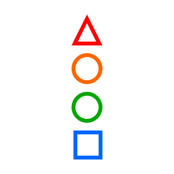
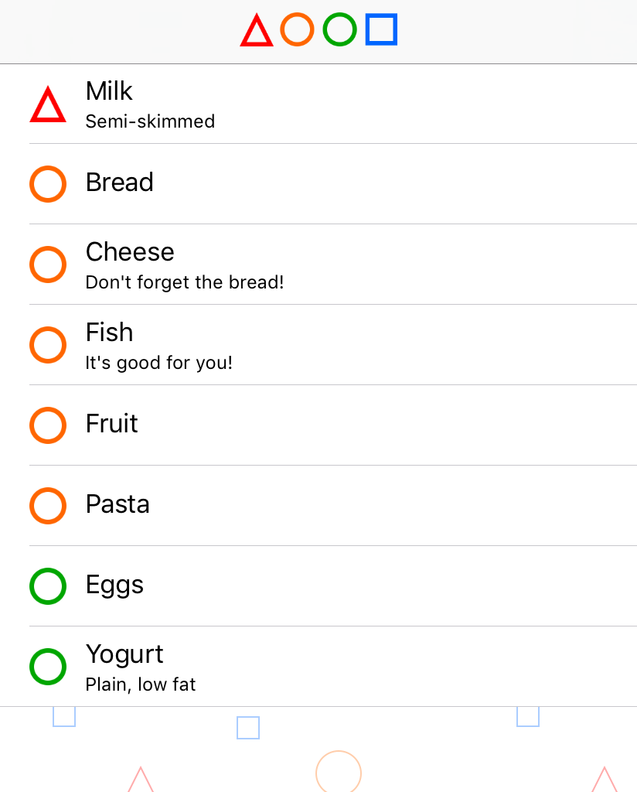

<section class="media-block media-block--plain">
  

    
    
  

  

    
Priorities

    
A minimal app for managing lists of prioritized items, designed around fast search, simple organization, and swipe-based updates.

  

</section>

<section class="media-block">
  

    
  

  

    
Simply manage lists of prioritized items.

    <ul class="feature-list">
      <li>Browse prioritized lists without extra setup.</li>
      <li>Update item priority with a swipe.</li>
      <li>Organize items hierarchically: any item can hold a prioritized list of items.</li>
      <li>Search quickly, add an existing item, or create a new one with a tap.</li>
    </ul>
  

</section>

Read about the app's updated design in [this blog post]() and about the original app's design in [this blog post]().

### Privacy policy

The Priorities app does not collect or share your personal information. The data you create with the app is stored locally on your device.
