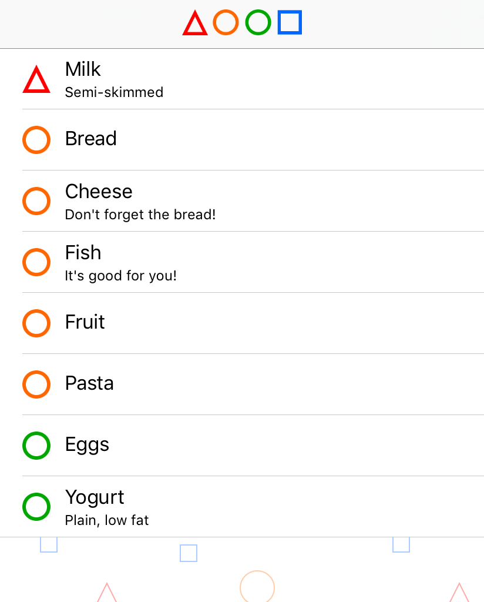

## Simply manage lists of prioritized items.

Minimalistic design:
* browse prioritized lists
* update item priority with a swipe
* any item can hold a prioritized list of items
* quickly search and manage items: add existing item or create new one with a tap

Read about the app's updated design in [this blog post]() and about the original app's design in [this blog post]().

### Privacy policy

The Priorities app does not collect or share your personal information. The data you create with the app is stored locally on your device.