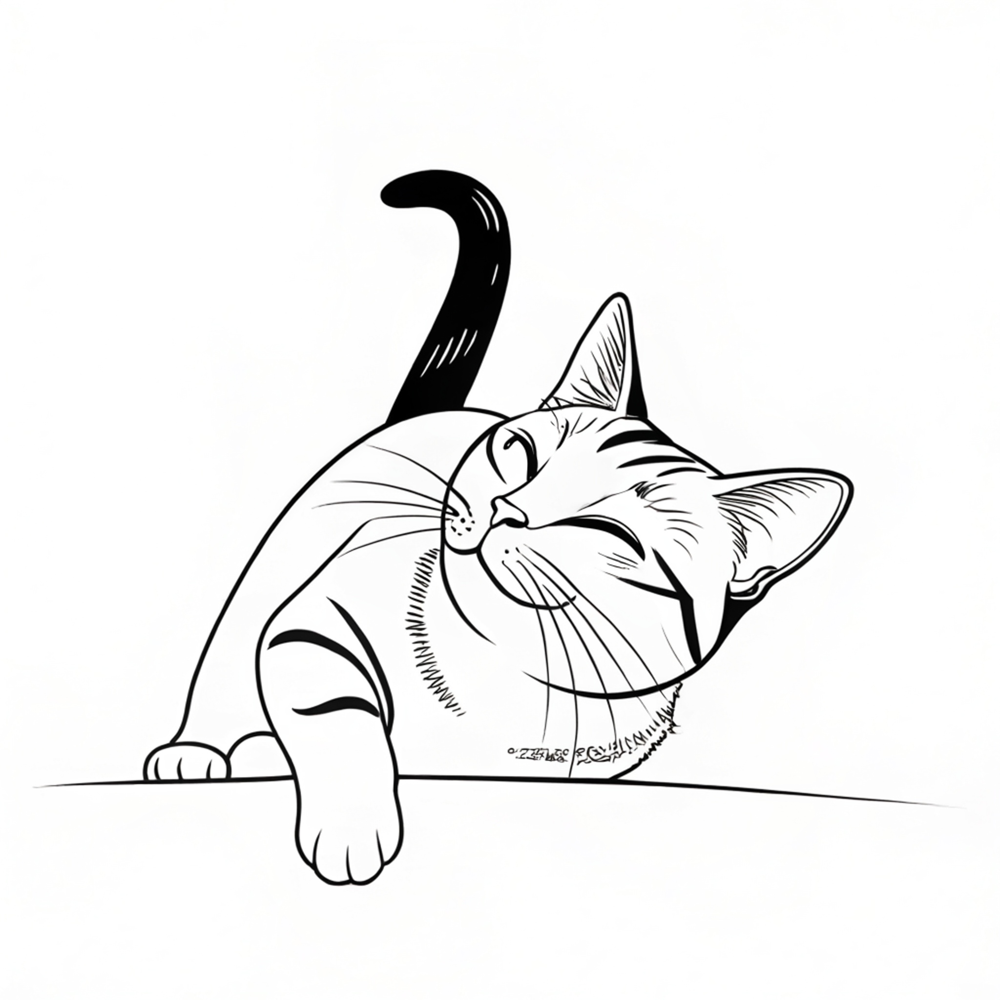

<table align="left" cellpadding="0" cellspacing="0" style="margin-left: auto; margin-right: auto; text-align: left;"><tr><td>

</td>
<td>
Purr is a calming, minimalist experience designed to help you disconnect from overstimulation.
Whether you’re trying to fall asleep or take a digital detox, Purr offers a soft, sensory-driven transition away from the chaos of typical phone use.
</td></tr></table>

<iframe width="560" height="315" src="https://youtube.com/embed/3bGdv0_gu7M" title="Purr video" frameborder="0" allow="accelerometer; autoplay; clipboard-write; encrypted-media; gyroscope; picture-in-picture; web-share" referrerpolicy="strict-origin-when-cross-origin" allowfullscreen></iframe>

&nbsp;

Feeling stuck in a doomscrolling spiral? Meet Purr, your gentle escape from compulsive phone use.

Purr is a calming, minimalist experience designed to help you disconnect from overstimulation—especially when it's time to wind down. Instead of endless feeds and flashing screens, Purr offers a soft, tactile ritual that brings your attention back to the present.

A cute, animated cat greets you as the app begins. Stroke the screen with your finger and your phone responds with a gentle purr through sound and haptics, guiding you into a quieter state.

There are no likes, no alerts, no noise. Just you, your breath, and a quiet moment with a purring phone.

Whether you’re trying to fall asleep or take a digital detox, Purr offers a soft, sensory-driven transition away from the chaos of typical phone use.

## Privacy Policy

The Purr app does not collect or share your personal information.

## Credits

Purr Copyright 2025 Alexandre R. J. François.
