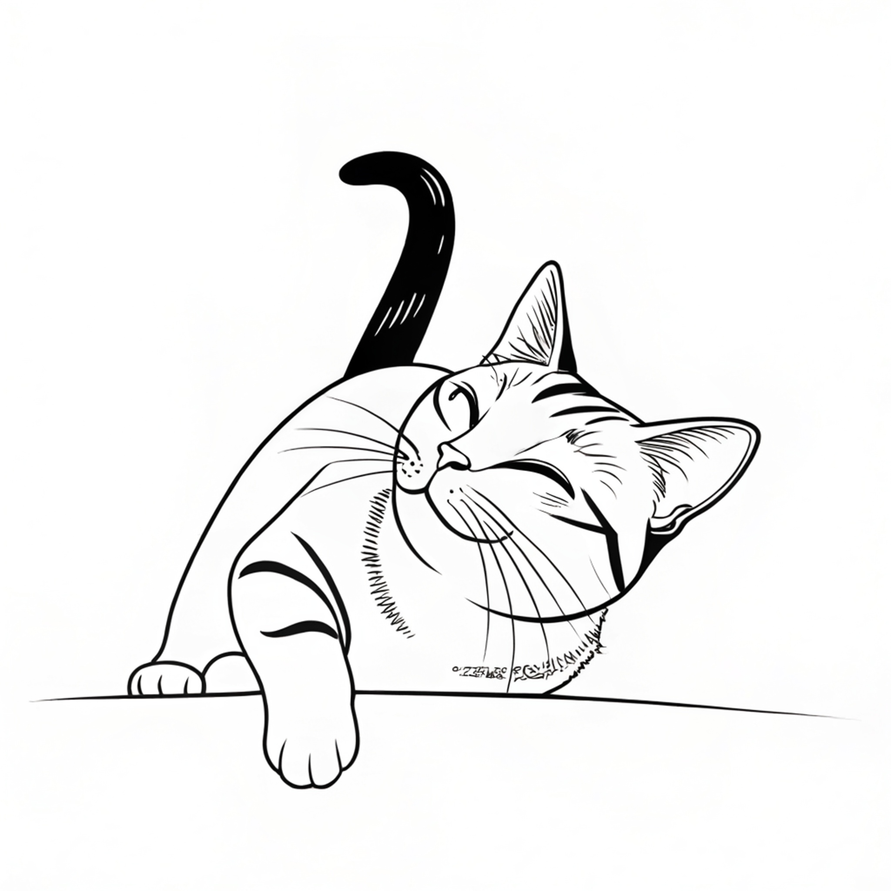

<section class="media-block media-block--plain">
  

    
    
  

  

    
Purr

    
A calming, minimalist experience designed to help you disconnect from overstimulation and transition gently away from compulsive phone use.

  

</section>

Feeling stuck in a doomscrolling spiral? Meet Purr, your gentle escape from compulsive phone use.

<section class="media-block">
  

    <video width="220" height="480" poster="assets/images/happy-cat.jpeg" controls>
      <source src="assets/videos/purr-video.mp4" type="video/mp4">
      Your browser does not support the video tag.
    </video>
  

  

    
A quieter phone ritual.

    <ul class="feature-list">
      <li>A cute, animated cat greets you as the app begins.</li>
      <li>Stroke the screen and your phone responds with gentle purring sound and haptics.</li>
      <li>No likes, no alerts, no noise. Just a soft tactile ritual that brings your attention back to the present.</li>
      <li>Designed for winding down, sleep preparation, and digital detox moments.</li>
    </ul>
  

</section>

## Privacy Policy

The Purr app does not collect or share your personal information.

## Credits

Purr Copyright 2025 Alexandre R. J. François.
