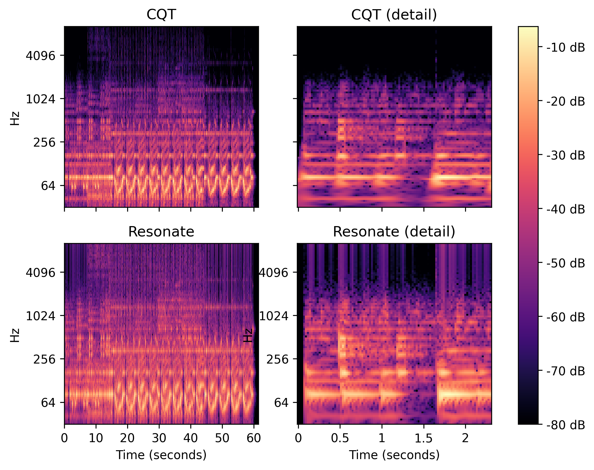
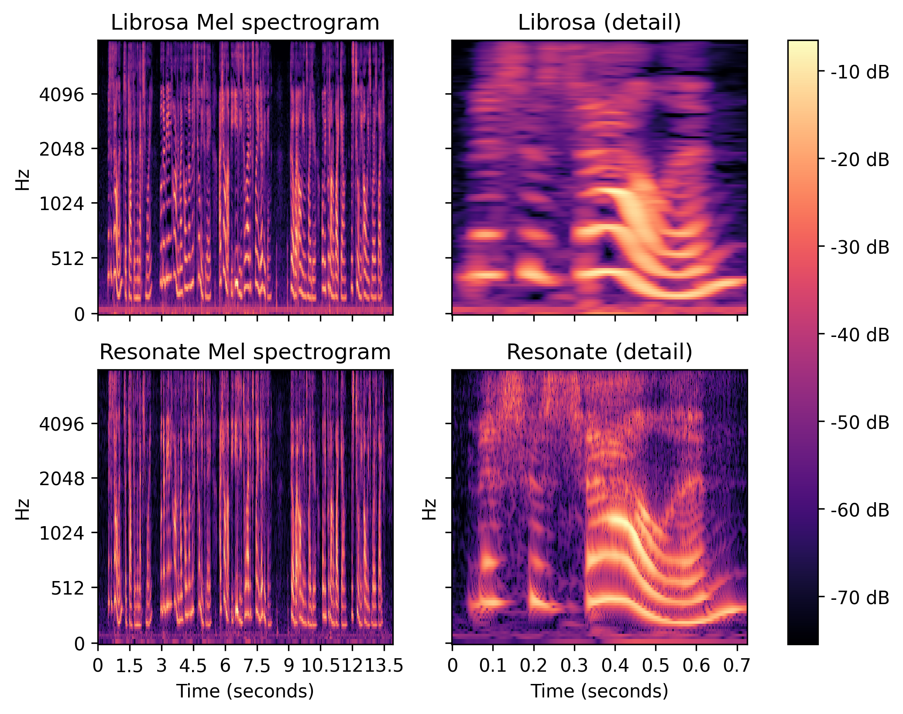

<table align="left" cellpadding="0" cellspacing="0" style="margin-left: auto; margin-right: auto; text-align: left;"><tr><td>

</td>
<td>

Resonate is a low latency, low memory footprint, and low computational cost algorithm to evaluate perceptually relevant spectral information from audio (and other) signals.

</td></tr></table>

## Overview

Resonate builds on a resonator model that accumulates the signal contribution around its resonant frequency in the time domain using the Exponentially Weighted Moving Average (EWMA), also known as a low-pass filter in signal processing. Consistently with on-line perceptual signal analysis, the EWMA gives more weight to recent input values, whereas the contributions of older values decay exponentially.
A compact, iterative formulation of the model affords computing an update at each signal input sample, requiring no buffering and involving only a handful of arithmetic operations.

Each resonator, characterized by its resonant frequency $$f = \frac{\omega}{2\pi}$$, is described by a complex number $$R$$ whose amplitude captures the contribution of the input signal component around frequency $$f$$.
The formulas below capture the recursive update for $$R$$ by way of a phasor $$P$$, applied for each sample $$x$$ of a real-valued input signal $$x(t) \in [-1,1]$$, regularly sampled at sampling rate $$sr$$. $$\Delta t=1/sr$$ is the sample duration, and $$\alpha \in [0,1]$$ is a constant parameter that dictates how much each new measurement affects the accumulated value.
 
$$P \leftarrow P e^{-i \omega \Delta t}$$

$$R \leftarrow (1-\alpha) R + \alpha x P$$

The two complex numbers $$P$$ and $$R$$ capture the full state of the resonator. Updating the state at each input signal sample only requires a handful of arithmetic operations. Calculating the power and/or magnitude is not necessary for the update, and can be carried out only when required by the application, relatively efficiently as well.
The single parameter $$\alpha$$, which can be related to a time constant, governs the dynamics of the system. For the frequency range of interest in audio applications (20-20000 Hz), the function $$\alpha_f = 1-e^{-\Delta t\frac{f}{log(1+f)} }$$ is a reasonable heuristic.
The smoothed state $$\tilde{R}$$ is produced by applying the EMWA to $$R$$ with the same $$\alpha$$ to dampen power and phase oscillations.
Finally, the output of each resonator is optionally normalized by the total response across the bank to a step signal of the resonator's frequency (equalization).
 
Banks of resonators, independently tuned to perceptually relevant frequency scales, compute an instantaneous, perceptually relevant estimate of the spectral content of an input signal in real-time.
Both memory and per-sample computational complexity of such a bank are linear in the number of resonators, and independent of the number of input samples processed, or duration of processed signal.
Furthermore, since the resonators are independent, there is no constraint on the tuning of their resonant frequencies or time constants, and all _per sample_ computations can be parallelized across resonators.
In an offline processing context, the cumulative computational cost for a given duration increases linearly with the number of input samples processed.

## Spectrograms

Spectral information as a function of time is typically presented graphically for human consumption in the form of a spectrogram, in which the horizontal axis represents time and the vertical axis represents frequency. The value at each point represents the power of the frequency in the input signal at the given time slice. These values are usually normalized by the maximum value over the signal, and mapped to a logarithmic color scale to produce plots like those shown below.
A Resonate oscillator bank with adequately tuned resonators computes an arbitrary frequency scale spectrogram directly and efficiently, with more relevant frequency resolution and much higher temporal resolutiont than FFT-based methods.

    
    <em>Log-frequency power spectrograms of <a href="https://librosa.org">Librosa</a>'s vibeace music example, computed from the constant-Q transform (CQT) and from a Resonate implementation (spectrogram display and CQT from Librosa, sampling rate: 22050Hz, hop length: 512 samples, 100 frequency bins from 32.7Hz to 9955.1Hz, 12 bins per octave).</em>

    
    <em>Mel-frequency power spectrograms of <a href="https://librosa.org">Librosa</a>'s Libri3 speech sample, computed from the constant-Q transform (CQT) and from a Resonate implementation (spectrogram display and CQT from Librosa, sampling rate: 22050Hz, hop length: 32 samples, 128 frequency bins from 0 to 8000Hz).</em>

## Publications

Alexandre R.J. François,
"Resonate: Efficient Low Latency Spectral Analysis of Audio Signals,"
to appear in Proceedings of the 50th Anniversary of the International Computer Music Conference 2025,
Boston, MA, USA, 8-14 June 2025.

## Resources

- The open source python module [noFFT](https://github.com/alexandrefrancois/noFFT) provides python and C++ implementations of Resonate functions and Jupyter notebooks illustrating their use in offline settings.

- The open source [Oscillators Swift package](https://github.com/alexandrefrancois/Oscillators) contains reference implementations in Swift and C++.
The [Oscillators app](https://alexandrefrancois.org/Oscillators/) demonstrates real-time spectrograms and derived audio features.

- The [Resonate Youtube playlist](https://www.youtube.com/playlist?list=PLVcB_ABiKC_cbemxXUUJXHAQsHEHxPOP1) features video captures of real-time demonstrations.
