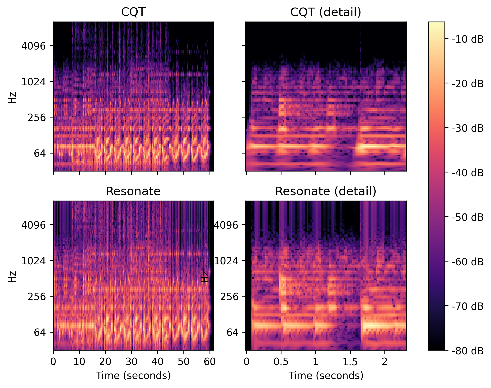
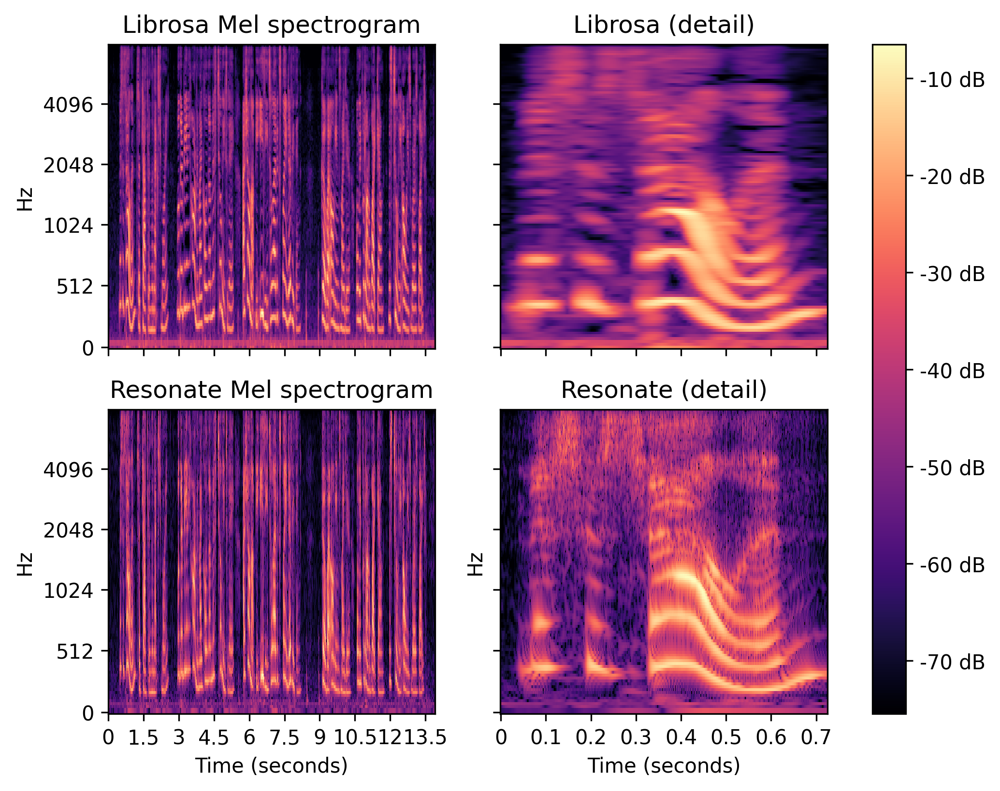

<table align="left" cellpadding="0" cellspacing="0" style="margin-left: auto; margin-right: auto; text-align: left;"><tr><td>

</td>
<td>

Resonate is a low latency, low memory footprint, and low computational cost algorithm to evaluate perceptually relevant spectral information from audio (and other) signals.

</td></tr></table>

## Overview

The Resonate model, developed over a number of years, was first officially introduced in <a href="#icmc25">(François, 2025)</a> and extended in <a href="#icmc26">(François, 2026)</a>.

Resonate builds on a resonator model that accumulates the signal contribution around its resonant frequency in the time domain using the Exponentially Weighted Moving Average (EWMA), also known as a low-pass filter in signal processing. Consistently with on-line perceptual signal analysis, the EWMA gives more weight to recent input values, whereas the contributions of older values decay exponentially.
A compact, iterative formulation of the model affords computing an update at each signal input sample, requiring no buffering and involving only a handful of arithmetic operations.

Each resonator (indexed $$k$$), characterized by its natural resonant frequency and its instantaneous resonant frequency $$f_k(t) = \frac{\omega_k(t)}{2\pi}$$, is described by a complex number $$R_k(t)$$ whose amplitude captures the contribution of the input signal component around frequency $$f_k(t)$$. The formulas below capture the recursive update formula for $$R_k(t)$$ by way of a phasor $$P_k(t)$$, applied for each sample of a real-valued input signal $$x(t) \in [-1,1]$$, regularly sampled at sampling rate $$sr$$. $$\Delta t=1/sr$$ is the sample duration.

$$P_k(t) = P_k(t-\Delta t) e^{-i \omega \Delta t}$$

$$R_k(t) = (1-\alpha_k) R_k(t-\Delta t) + \alpha_k x(t) P_k(t)$$

The parameter $$\alpha_k \in [0,1]$$ dictates how much each new measurement affects the accumulated value; it can be expressed as a function of the system's time constant, set heuristically as a function of the resonant frequency $$f$$ (intuitively inversely proportional to the frequency).
For the frequency range of interest in audio applications (20-20000 Hz), $$\alpha_k = 1-e^{-\Delta t\frac{f_k}{log(1+f_k)} }$$ is a reasonable heuristic.

The smoothed state $$\tilde{R}_k$$ is produced by applying the EMWA to $$R_k$$ with parameter $$\beta_k$$ to dampen power and phase oscillations.

$$\tilde{R}_k(t) = (1-\beta_k) \tilde{R}_k(t-\Delta t) + \beta_k R_k(t)$$

This formulation is consistent with the first steps in the filterbank interpretation of the phase vocoder analysis as described by Dolson in his 1986 paper "The Phase Vocoder: A Tutorial", namely heterodyning followed by lowpass filtering.

The complex numbers $$P_k(t)$$, $$R_k(t)$$ and $$\tilde{R}_k(t)$$ capture the full state of resonator $$k$$.
Updating the state at each input signal sample only requires a handful of arithmetic operations.
Calculating the power and/or magnitude is not necessary for the update, and can be carried out only when required by the application, relatively efficiently as well.

Banks of resonators, independently tuned to perceptually relevant frequency scales, compute an instantaneous, perceptually relevant estimate of the spectral content of an input signal in real-time.
Both memory and per-sample computational complexity of such a bank are linear in the number of resonators, and independent of the number of input samples processed, or duration of processed signal.
Furthermore, since the resonators are independent, there is no constraint on the tuning of their resonant frequencies or time constants, and all _per sample_ computations can be parallelized across resonators.
In an offline processing context, the cumulative computational cost for a given duration increases linearly with the number of input samples processed.

The original model presented in <a href="#icmc25">(François, 2025)</a> keeps the resonant frequency of the resonators fixed, as is the case with the Fast Fourier Transform (FFT).
However, there is no such restriction on Resonate resonators.

In the frequency tracking model presented in <a href="#icmc26">(François, 2026)</a>, the resonant frequency a resonator is allowed to change over time:
in the absence of significant information (i.e. below a set magnitude threshold for $R_k(t)$), the resonant frequency remains constant, equal to the resonator's natural resonant frequency.
In the presence of significant response, however, the resonant frequency tracks the estimated instantaneous frequency.

At each time step, the phase difference $$\Delta \phi_k(t)$$ between the previous and current value of $$\tilde{R}_k(t)$$ provides an estimate of the phase's time derivative, to compute the corresponding instantaneous frequency.

$$f_k(t) = f_k(t-\Delta t) + \frac {\Delta \phi_k(t)}{2\pi \Delta T}$$

Using the property that the phase of a complex number multiplied by the conjugate of another complex number is the phase difference between the two numbers yields a formula for $$\Delta \phi_k(t)$$ that requires only one principal value argument computation.

$$D_k(t) = \tilde{R}\_k(t) \overline{\tilde{R}\_k}(t-\Delta t)$$

$$\Delta \phi_k(t) = Arg(D_k(t))\label{eq:delta_phi}$$

Because $$\Delta \phi_k(t)$$ is computed for each input sample, there is no concern of phase unwrapping, a crucial necessary step in FFT-based vocoder analysis when the hop length is greater than 1 (or when explicitly computing and subtracting phases).

Angular velocity changes are stabilized by applying an EWMA with time constant $$\gamma_k$$.

$$\omega_k(t) = \omega_k(t-\Delta t) + \gamma_k \frac{\Delta \phi_k(t)}{\Delta T}$$

The update rule for the phasor $$P_k(t)$$ becomes:

$$P_k(t) = P_k(t-\Delta t) e^{-i \omega_k(t) \Delta t}$$

By construction, when subjected to an input sinusoidal signal of variable amplitude and frequency near the resonator's natural frequency, the system's resonant frequency tracks the estimated input frequency.
Consequently, the resonator's magnitude is directly proportional to the signal's amplitude.

A bank composed of frequency tracking resonators constantly self-tunes to the contents of the input signal.
The actual tuning (natural frequencies) of the resonators in the bank does not matter, as long as the bank offers an appropriate coverage of the frequency range of interest.
The bank continuously self-tunes to the content of the input signal.
Optimal density and distribution of natural frequencies may vary for different applications.

The extended model formulation builds on the same compact, iterative approach, which affords computing an update at each signal input sample, requiring no buffering and involving only a handful of arithmetic operations, and adding one single transcendental function computation per resonator.
Straightforward reference implementations exhibit real-time performance on modern hardware, while vectorized parallel implementations taking advantage of SIMD architectures further reduce computation time, and therefore latency.
The open source [Oscillators Swift package](https://github.com/alexandrefrancois/Oscillators) contains reference implementations in Swift and C++.

Self-tuning banks form the basis for an analysis technique that produces, in real-time, for each input sample, a list of uniquely identified and precisely tracked frequency components present in the input signal, together with their correct amplitude.

## Spectrograms

Spectral information as a function of time is typically presented graphically for human consumption in the form of a spectrogram, in which the horizontal axis represents time and the vertical axis represents frequency. The value at each point represents the power of the frequency in the input signal at the given time slice. These values are usually normalized by the maximum value over the signal, and mapped to a logarithmic color scale to produce plots like those shown below.
These were computed off-line in a Python environment and rendered with [Librosa](https://librosa.org)'s `specshow` function.

### Classical Spectrograms

A Resonate oscillator bank with adequately tuned resonators computes an arbitrary frequency scale spectrogram directly and efficiently, with more relevant frequency resolution and much higher temporal resolution than FFT-based methods. The log-frequency power spectrograms shown here offer direct comparison with classical spectrograms computed from the Constant Q-Transform (CQT). Resonator resonant frequencies are fixed and geometrically distributed over the range of interest.

    
    <em>Log-frequency power spectrograms of <a href="https://librosa.org">Librosa</a>'s vibeace music example, computed from the constant-Q transform (CQT) and from a Resonate implementation (spectrogram display and CQT from Librosa, sampling rate: 22050Hz, hop length: 512 samples, 100 frequency bins from 32.7Hz to 9955.1Hz, 12 bins per octave).</em>

    
    <em>Mel-frequency power spectrograms of <a href="https://librosa.org">Librosa</a>'s Libri3 speech sample, computed from the constant-Q transform (CQT) and from a Resonate implementation (spectrogram display and CQT from Librosa, sampling rate: 22050Hz, hop length: 32 samples, 128 frequency bins from 0 to 8000Hz).</em>

### Tracking Spectrograms

This [video](https://youtu.be/bnvK5Nll4Sg) presents screen recordings of real signal spectrograms computed in real-time with frequency tracking resonator banks.
The input signal is sampled at 44.1 kHz.
The vertical axis represents frequency (log scale), computed from 112 resonators, displayed at a resolution of 336 frequency bands geometrically spaced from 32.7 Hz at the bottom to 19910 Hz at the top.
One vertical slice is rendered in real time every 64 samples, or 1.46 ms.
The actual time resolution limit for spectral data is the same as that of the input signal.

## Synthesis

Processing by a Resonate tracking resonator bank produces a magnitude and phase for each input sample. This dense information can be used to synthesize an audio signal.
Applying the inverse phasors $$P_k^{-1}(t)$$ to individual tracking resonators $$\tilde{R}_k(t)$$ yields the complex numbers $$S_k(t)$$, from which an audio signal corresponding to the input signal's component can readily be produced.
The reverse phasor can optionally introduce a frequency shift ratio $$fs$$ and a different target sampling rate $$sr_s = 1 / \Delta t_s$$ (time manipulation).
A frequency ratio of 1 keeps the frequency unchanged, values greater or lower than 1 result in higher or lower frequency, respectively.
A sampling rate equal to the input's sampling rate keeps the timing/speed, a greater or lower sampling rate results in a shorter or longer duration output signal, respectively.

$$P_k^{-1}(t) = P_k^{-1}(t-\Delta t_s) e^{i \omega_k(t) fs \Delta t_s}$$

$$S_k(t) = \tilde{R}\_k(t) P_k^{-1}(t)$$

Summing up the $$S_k(t)$$ over the resonators which are actually tracking and whose natural frequency is closest to the tracked frequency, and taking only the real part yields an audio signal $$s(t)$$ which captures salient features of the input signal.

$$s(t) = K Re( \sum{S_k(t)} )$$

### Synthesis Examples

#### "Who's Loving You" (The Jackson 5)

Original:
<audio controls>

<source src="assets/audio/original-wly.mp3" type="audio/mpeg">
Your browser does not support the audio element.
</audio>

<table align="left" cellpadding="0" cellspacing="0" style="margin-left: auto; margin-right: auto; text-align: left;"><tr><td>
Speed
</td><td>
No frequency shift</td><td>
Down 2 semitones</td><td>
Up 2 semitones</td><td>
</td></tr><tr><td>
100%
</td><td>
<audio controls>
    <source src="assets/audio/synthesized-wly-f1.0-sr44100.wav" type="audio/wav">
    Your browser does not support the audio element.
</audio>
</td><td>
<audio controls>
    <source src="assets/audio/synthesized-wly-f0.89-sr44100.wav" type="audio/wav">
    Your browser does not support the audio element.
</audio>
</td><td>
<audio controls>
    <source src="assets/audio/synthesized-wly-f1.12-sr44100.wav" type="audio/wav">
    Your browser does not support the audio element.
</audio>
</td></tr><tr><td>
80%</td><td>
<audio controls>
    <source src="assets/audio/synthesized-wly-f1.0-sr35280.wav" type="audio/wav">
    Your browser does not support the audio element.
</audio>
</td><td>
<audio controls>
    <source src="assets/audio/synthesized-wly-f0.89-sr35280.wav" type="audio/wav">
    Your browser does not support the audio element.
</audio>
</td><td>
<audio controls>
    <source src="assets/audio/synthesized-wly-f1.12-sr35280.wav" type="audio/wav">
    Your browser does not support the audio element.
</audio>
</td></tr><tr><td>
120%</td><td>
<audio controls>
    <source src="assets/audio/synthesized-wly-f1.0-sr52920.wav" type="audio/wav">
    Your browser does not support the audio element.
</audio>
</td><td>
<audio controls>
    <source src="assets/audio/synthesized-wly-f0.89-sr52920.wav" type="audio/wav">
    Your browser does not support the audio element.
</audio>
</td><td>
<audio controls>
    <source src="assets/audio/synthesized-wly-f1.12-sr52920.wav" type="audio/wav">
    Your browser does not support the audio element.
</audio>
</td></tr></table>

#### "Une Simple Melodie" (Michel Polnareff)

Original:
<audio controls>

<source src="assets/audio/original-usm.wav" type="audio/wav">
Your browser does not support the audio element.
</audio>

<table align="left" cellpadding="0" cellspacing="0" style="margin-left: auto; margin-right: auto; text-align: left;"><tr><td>
Speed
</td><td>
No frequency shift</td><td>
Down 2 semitones</td><td>
Up 2 semitones</td><td>
</td></tr><tr><td>
100%
</td><td>
<audio controls>
    <source src="assets/audio/synthesized-usm-f1.0-sr44100.wav" type="audio/wav">
    Your browser does not support the audio element.
</audio>
</td><td>
<audio controls>
    <source src="assets/audio/synthesized-usm-f0.89-sr44100.wav" type="audio/wav">
    Your browser does not support the audio element.
</audio>
</td><td>
<audio controls>
    <source src="assets/audio/synthesized-usm-f1.12-sr44100.wav" type="audio/wav">
    Your browser does not support the audio element.
</audio>
</td></tr><tr><td>
50%</td><td>
<audio controls>
    <source src="assets/audio/synthesized-usm-f1.0-sr22050.wav" type="audio/wav">
    Your browser does not support the audio element.
</audio>
</td><td>
</td><td>
</td></tr><tr><td>
75%</td><td>
<audio controls>
    <source src="assets/audio/synthesized-usm-f1.0-sr33075.wav" type="audio/wav">
    Your browser does not support the audio element.
</audio>
</td><td>
</td><td>
</td></tr><tr><td>
150%</td><td>
<audio controls>
    <source src="assets/audio/synthesized-usm-f1.0-sr66150.wav" type="audio/wav">
    Your browser does not support the audio element.
</audio>
</td><td>
</td><td>
</td></tr><tr><td>
200%</td><td>
<audio controls>
    <source src="assets/audio/synthesized-usm-f1.0-sr88200.wav" type="audio/wav">
    Your browser does not support the audio element.
</audio>
</td><td>
</td><td>
</td></tr></table>

## Publications

Alexandre R.J. François,
"Real-Time, Low-Latency, High Resolution Audio Spectral Analysis: Phase Matters,"
to appear in Proceedings of the International Computer Music Conference 2026, Hamburg, Germany, 10-16 May 2026.

**Best Paper Award** | Alexandre R.J. François,
"Resonate: Efficient Low Latency Spectral Analysis of Audio Signals,"
in Proceedings of the [50th Anniversary of the International Computer Music Conference 2025](https://icmc2025.sites.northeastern.edu),
pp. 251-258, Boston, MA, USA, 8-14 June 2025.
[[pdf](/assets/publications/FrancoisARJ-ICMC2025.pdf)]

## Presentations

Alexandre R.J. François, "Real-time, low latency and high temporal resolution spectrograms,"
[Audio Developer Conference (ADC25)](https://audio.dev/conference/),
Bristol, November 10-12.
[[pdf](/assets/publications/FrancoisARJ-ADC25.pdf)]
[[Video on YouTube](https://youtu.be/QbNPA5QJ6OU)]

Alexandre R.J. François, "Real-time low latency audio features with Resonate" (Late-Breaking Demo Paper),
[First AES International Conference on Artificial Intelligence and Machine Learning for Audio (AIMLA 2025)](https://aes2.org/event-extra/2025-aes-international-conference-on-artificial-intelligence-and-machine-learning-for-audio/),
London, Sept. 8-10, 2025.
[[pdf](https://drive.google.com/file/d/1qTtUrwRJytMeSnqb56ETZqIj2erSgWTO/view)]

## Resources

- The open source python module [noFFT](https://github.com/alexandrefrancois/noFFT) provides python and C++ implementations of Resonate functions and Jupyter notebooks illustrating their use in offline settings.

- The open source [Oscillators Swift package](https://github.com/alexandrefrancois/Oscillators) contains reference implementations in Swift and C++.
  The [Oscillators app](https://alexandrefrancois.org/Oscillators/) demonstrates real-time spectrograms and derived audio features.

- The [Resonate Youtube playlist](https://www.youtube.com/playlist?list=PLVcB_ABiKC_cbemxXUUJXHAQsHEHxPOP1) features video captures of real-time demonstrations.

- [Resonate Store](https://resonate.myspreadshop.co.uk)
