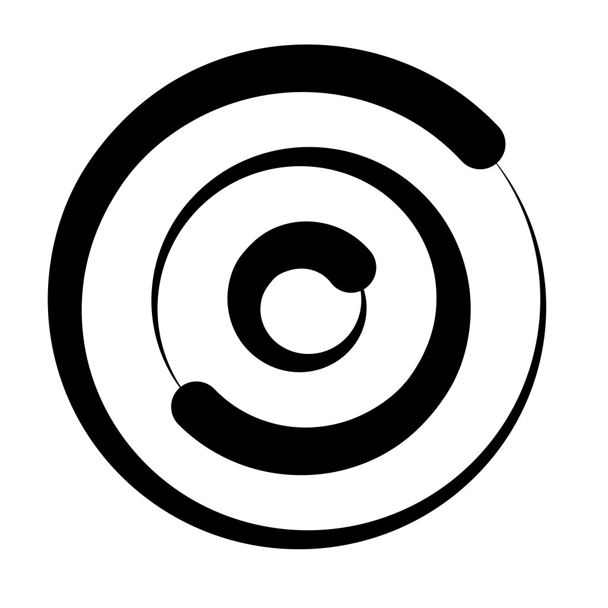

<section class="intro">
  
Software engineer and researcher working at the intersection of interactive systems, audio, music computing, computer vision, and graphics.

  <ul class="intro-list">
    <li>Hands-on leader, problem solver, educator, and mentor</li>
    <li>Interested in the design, analysis, and implementation of interactive software systems</li>
    <li>Experienced in audio and video computing, music computing, computer vision, and computer graphics</li>
  </ul>
  

    <a href="https://www.linkedin.com/in/alexandrefrancois/">LinkedIn</a>
    <a href="https://github.com/alexandrefrancois">GitHub</a>
    <a href="https://www.youtube.com/user/alexandrefrancois">YouTube</a>
  

  

    <a href="academia">Academia</a>
    <a href="/academia/research">Research</a>
    <a href="/academia/publications">Publications</a>
    <a href="/academia/presentations">Presentations</a>
    <a href="/academia/events">Events</a>
    <a href="/academia/teaching">Teaching</a>
  

</section>

<section class="media-block media-block--compact">
  

    
  

  

    
<a href="/Resonate">Resonate</a>

    
A low latency, low memory footprint, and low computational cost algorithm to evaluate perceptually relevant spectral information from audio and other signals.

  

</section>

I will give a talk titled "Low latency, high temporal and frequency resolution spectral analysis of audio signals: all about that phase" at the [Audio Developer Conference (ADC26)](https://audio.dev/adc-bristol-26/), Bristol, November 9-11, 2026.

I presented my paper "[Real-Time, Low-Latency, High Resolution Audio Spectral Analysis: Phase Matters](/assets/publications/FrancoisARJ-ICMC2026.pdf)" at the [2026 International Computer Music Conference](https://icmc2026.ligeti-zentrum.de) (ICMC) on May 14 2026.
[[Demo video on YouTube]](https://www.youtube.com/watch?v=bnvK5Nll4Sg)  
This is building on the work that received the [Best Paper Award at last year's ICMC](/assets/publications/FrancoisARJ-ICMC2025.pdf), where I introduced the Resonate model.

I gave a talk titled "[Real-time, low latency and high temporal resolution spectrograms](/assets/publications/FrancoisARJ-ADC25.pdf)" on the implementation of Resonate and Resonate-based spectrograms at the [Audio Developer Conference (ADC25)](https://audio.dev/archive/adc25-bristol/), Bristol, November 10-12, 2025. [[YouTube]](https://youtu.be/QbNPA5QJ6OU)

## Published Apps

  

    
    

      <a href="/Oscillators">Oscillators</a>
      
Experiment with digital resonators.

    

  

  

    
    

      <a href="/MuSA_RT">MuSA_RT</a>
      
Experience a visual representation of tonal patterns in music as it is being performed.

    

  

  

    
    

      <a href="/Priorities">Priorities</a>
      
Simply manage lists of prioritized items.

    

  

  

    
    

      <a href="/Purr">Purr</a>
      
Soothe Your Screen Time. Mindful vibes. Cat included.

    

  

  

    
    

      <a href="/BreathWheel">BreathWheel</a>
      
Breathe. You're in control.

    

  

## Open Source Projects

  

    <a href="https://github.com/alexandrefrancois/Oscillators">Oscillators</a>
    
Digital oscillator models for signal synthesis and analysis, suitable for real-time audio processing.

  

  

    <a href="https://github.com/alexandrefrancois/noFFT">noFFT</a>
    
A reference implementation of the Resonate algorithm in C++ for Python.

  

  

    <a href="https://github.com/alexandrefrancois/WheelControl">WheelControl</a>
    
A SwiftUI wheel control with multiple speeds.

  

<!-- ### Archives

- My old [blog](http://alexandrefrancois.blogspot.com)
- My old [site](https://sites.google.com/site/alexandrerjfrancois) -->
