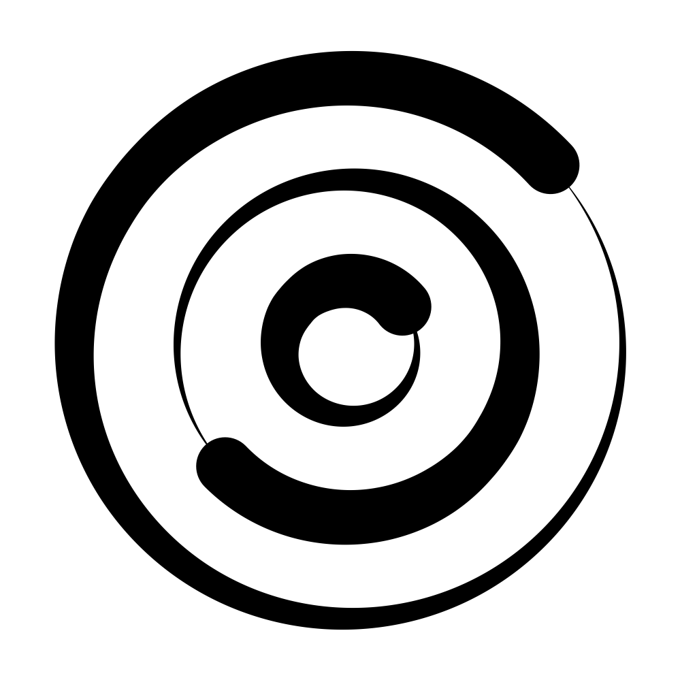

- Hands on leader, problem solver, educator and mentor
- Interests: design, analysis and implementation of interactive software systems
- Skills: audio and video computing, music computing, computer vision, computer graphics

[LinkedIn](https://www.linkedin.com/in/alexandrefrancois/) || [GitHub](https://github.com/alexandrefrancois) || [YouTube](https://www.youtube.com/user/alexandrefrancois)  
[Academia](academia) ||
[research](/academia/research)
| [publications](/academia/publications)
| [presentations](/academia/presentations)
| [events](/academia/events)
| [teaching](/academia/teaching)

<table align="left" cellpadding="0" cellspacing="0" style="margin-left: auto; margin-right: auto; text-align: left;"><tr><td>

</td>
<td>

<strong><a href="/Resonate">Resonate</a></strong> is a low latency, low memory footprint, and low computational cost algorithm to evaluate perceptually relevant spectral information from audio (and other) signals.

</td></tr></table>

"[Resonate: Efficient Low Latency Spectral Analysis of Audio Signals](/assets/publications/FrancoisARJ-ICMC2025.pdf)" received the **Best Paper Award**
at the [50th Anniversary of the International Computer Music Conference 2025](https://icmc2025.sites.northeastern.edu), which took place June 8-14 in Boston, MA, USA.

I will give a late breaking demonstration of Resonate-based real-time, low latency audio features computation at the [First AES International Conference on Artificial Intelligence and Machine Learning for Audio (AIMLA 2025)](https://aes2.org/events-calendar/2025-aes-international-conference-on-artificial-intelligence-and-machine-learning-for-audio/), London, Sept. 8-10, 2025.

I will give a talk titled "Real-time, low latency and high temporal resolution spectrograms" on the implementation of Resonate and resonate-based spectrograms at the [Audio Developer Conference](https://audio.dev/conference/), Bristol, November 10-12.

    The <a href="https://resonate.myspreadshop.co.uk">Resonate Store</a> is live!
     
    

    

## Published Apps

- [Oscillators](/Oscillators): Experiment with digital resonators.
- [MuSA_RT](/MuSA_RT): Experience a visual representation of tonal patterns - pitches, chords, key - in music as it is being performed.
- [Priorities](/Priorities): Simply manage lists of prioritized items.
- [Purr](/Purr): Soothe Your Screen Time. Mindful vibes. Cat included.
- [BreathWheel](/BreathWheel): Breathe. You're in control.

### Open Source Projects

- [Oscillators](https://github.com/alexandrefrancois/Oscillators): Digital oscillator models for signal synthesis and analysis, suitable for real-time audio processing.
- [noFFT](https://github.com/alexandrefrancois/noFFT): A reference implementation of the Resonate algorithm in C++ for Python.
- [WheelControl](https://github.com/alexandrefrancois/WheelControl): A SwiftUI wheel control with multiple speeds.

### Archives

- My old [blog](http://alexandrefrancois.blogspot.com)
- My old [site](https://sites.google.com/site/alexandrerjfrancois)
